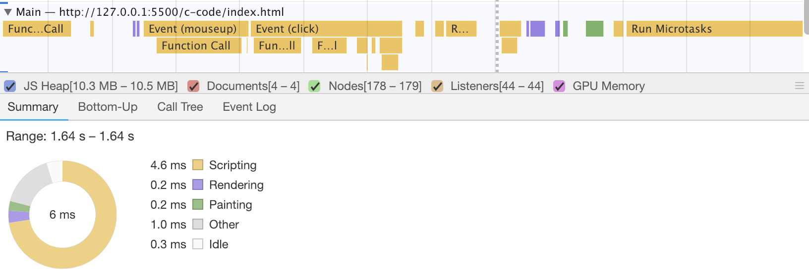

<!--from-event-loop-to-JS-asynchronous-->

从 [HTML Standard](https://whatwg-cn.github.io/html/) 学习关于 Event loop 的知识。

<!--more-->

# 实例

https://juejin.im/post/5c9a43175188252d876e5903?utm_source=gold_browser_extension

## 得心应手

```js
setTimeout(() => {
  console.log(1);
}, 0);
Promise.resolve().then(() => {
  console.log(2);
});
console.log(3);

// 3 2 1
```

- main script 运行结束后，会有微任务队列和宏任务队列
- 微任务先执行，之后是宏任务

## 游刃有余

```js
setTimeout(() => {
  console.log(1);
}, 0);
const a = new Promise((resolve) => {
  console.log(2);
  resolve();
})
  .then(() => {
    console.log(3);
  })
  .then(() => {
    console.log(4);
  });
console.log(5);

// 2 5 3 4 1

// 如果没有 resolve，则是 2 5 1
```

- Promise 的 executor 是一个同步函数，即非异步，立即执行的一个函数，因此他应该是和当前的任务一起执行的
- 而 Promise 的链式调用 then，每次都会在内部生成一个新的 Promise，然后执行 then，在执行的过程中不断向微任务(microtask)推入新的函数，因此直至微任务(microtask)的队列清空后才会执行下一波的 macrotask

## 炉火纯青

- 首先要心中有一个队列，能够将这些函数放到相对应的队列之中

```js
new Promise((resolve, reject) => {
  console.log('promise1');
  resolve();
})
  .then(() => {
    console.log('then11');
    new Promise((resolve, reject) => {
      console.log('promise2');
      resolve();
    })
      .then(() => {
        // 注意，then21 比 then12 早输出，因为 then 更早执行
        console.log('then21');
      })
      .then(() => {
        console.log('then23');
      });
  })
  .then(() => {
    console.log('then12');
  });

// promise1 then11 promise2 then21 then12 then23
```

```js
new Promise((resolve, reject) => {
  console.log('promise1');
  resolve();
})
  .then(() => {
    console.log('then11');
    return new Promise((resolve, reject) => {
      console.log('promise2');
      resolve();
    })
      .then(() => {
        console.log('then21');
      })
      .then(() => {
        console.log('then23');
      });
  })
  .then(() => {
    console.log('then12');
  });

// 如果是 return new Promise，then 的先后就不同了
// promise1 then11 promise2 then21 then23 then12
```

# 调用动画

- Call Stack
- Web Apis
- Callback Queue

在线查看调用过程：[loupe](http://latentflip.com/loupe/?code=JC5vbignYnV0dG9uJywgJ2NsaWNrJywgZnVuY3Rpb24gb25DbGljaygpIHsKICAgIHNldFRpbWVvdXQoZnVuY3Rpb24gdGltZXIoKSB7CiAgICAgICAgY29uc29sZS5sb2coJ1lvdSBjbGlja2VkIHRoZSBidXR0b24hJyk7ICAgIAogICAgfSwgMjAwMCk7Cn0pOwoKY29uc29sZS5sb2coIkhpISIpOwoKc2V0VGltZW91dChmdW5jdGlvbiB0aW1lb3V0KCkgewogICAgY29uc29sZS5sb2coIkNsaWNrIHRoZSBidXR0b24hIik7Cn0sIDUwMDApOwoKY29uc29sZS5sb2coIldlbGNvbWUgdG8gbG91cGUuIik7!!!PGJ1dHRvbj5DbGljayBtZSE8L2J1dHRvbj4%3D)

# 规范定义

用户交互，脚本，渲染，网络等，用户代理必须使用 event loop

那么采纳 JSC 引擎的术语：

- 把宿主发起的任务称为宏观任务
- 把 JavaScript 引擎发起的任务称为微观任务

## 任务队列

- macro tasks：可以有多个
  - setTimeout
  - setInterval
  - setImmediate
  - I/O
  - UI rendering
- micro tasks：只有一个
  - process.nextTick
  - Promise
  - Object.observer
  - MutationObserver

## 运行环境

- 浏览器：HTML5 标准
- NodeJS：libuv

## 执行流程

- 当 JS 的 stack 为空时
- 取一个宏任务来执行，执行完毕后，下一步
- 取一个微任务来执行，执行完毕后，再取一个微任务来执行。直到微任务队列为空，执行下一步
- 更新 UI 渲染

## rendering 实验

### setTimeout

```html
<body>
  <div id="con">this is con</div>
  <script>
    const con = document.getElementById('con');
    con.onclick = function () {
      setTimeout(function setTimeout1() {
        con.innerHTML = 0;
      }, 0);
    };
  </script>
</body>
```



**黄色部分是脚本运行，紫色部分是更新 render 树、计算布局，绿色部分是绘制**

绿色和紫色部分可以认为是 `Update the rendering`

### Promise.resolve

```html
<body>
  <div id="con">this is con</div>
  <script>
    const con = document.getElementById('con');
    con.onclick = function () {
      Promise.resolve().then(function Promise1() {
        con.innerHTML = 0;
      });
    };
  </script>
</body>
```


### 两个 setTimeout

```html
<body>
  <div id="con">this is con</div>
  <script>
    const con = document.getElementById('con');
    con.onclick = function click1() {
      setTimeout(function setTimeout1() {
        con.innerHTML = 0;
      }, 0);
      setTimeout(function setTimeout2() {
        con.innerHTML = 1;
      }, 0);
    };
  </script>
</body>
```


### setTimeout + Promise.resolve

```html
<body>
  <div id="con">this is con</div>
  <script>
    const con = document.getElementById('con');
    con.onclick = function click1() {
      setTimeout(() => {
        con.innerHTML = 0;
      }, 0);

      Promise.resolve().then(() => {
        con.innerHTML = 1;
      });
    };
  </script>
</body>
```


这就有意思的，图上没有 Painting，放在 `Promise.resolve` 中的 DOM 修改没有真正现在在页面上。

# event loops 应用

event loop 的大致循环过程


假设现在执行到 currently running task，我们对批量的 dom 进行异步修改，我们将此任务插进 task


此任务插进 microtasks


## 优化 DOM 操作

```js
const store = {};
const flag = false;
function bar(num, id) {
  store[id] = num;
  if (!flag) {
    Promise.resolve().then(function () {
      for (const k in store) {
        const num = store[k];
        const product = num * num;
        const resultEle = document.getElementById(k);
        resultEle.textContent = product;
      }
    });
    flag = true;
  }
}
```

现在我们用一个 store 去存储参数，统一在 microtasks 阶段执行，过滤了多余的计算，即使同步过程中多次对一个元素修改，也只会响应最后一次。

# Event Loop 异步更新策略

Vue 和 React 都实现了异步更新策略。虽然实现的方式不尽相同，但都达到了减少 DOM 操作、避免过度渲染的目的。

<!--more-->

## Micro-Task 与 Macro-Task

事件循环中的异步队列有两种：macro（宏任务）队列和 micro（微任务）队列。

- 常见的 macro-task：setTimeout、setInterval、 setImmediate、script（整体代码）、 I/O 操作、UI 渲染等。
- 常见的 micro-task: process.nextTick、Promise、MutationObserver 等。

## Event Loop 过程

- 初始状态：调用栈空。micro 队列空，macro 队列里有且只有一个 script 脚本（整体代码）。
- 全局上下文（script 标签）被推入调用栈，同步代码执行。在执行的过程中，通过对一些接口的调用，可以产生新的 macro-task 与 micro-task，它们会分别被推入各自的任务队列里。同步代码执行完了，script 脚本会被移出 macro 队列，**这个过程本质上是队列的 macro-task 的执行和出队的过程**。
- 上一步我们出队的是一个 macro-task，这一步我们处理的是 micro-task。但需要注意的是：当 macro-task 出队时，任务是**一个一个执行**的；而 micro-task 出队时，任务是**一队一队执行**的（如下图所示）。因此，我们处理 micro 队列这一步，会逐个执行队列中的任务并把它出队，直到队列被清空。


- 执行渲染操作，更新界面
- 检查是否存在 Web worker 任务，如果有，则对其进行处理 。

## 渲染的时机

假如我想要在异步任务里进行 DOM 更新，我该把它包装成 micro 还是 macro 呢？

先假设它是一个 macro 任务，比如我在 script 脚本中用 setTimeout 来处理它：

```js
// task是一个用于修改DOM的回调
setTimeout(task, 0);
```

现在 task 被推入的 macro 队列。但因为 script 脚本本身是一个 macro 任务，所以本次执行完 script 脚本之后，下一个步骤就要去处理 micro 队列了，再往下就去执行了一次 render。但本次 render 我的目标 task 其实并没有执行，想要修改的 DOM 也没有修改，因此这一次的 render 其实是一次无效的 render。

转向 micro 试试看。用 Promise 来把 task 包装成是一个 micro 任务：

```js
Promise.resolve().then(task);
```

那么我们结束了对 script 脚本的执行，是不是紧接着就去处理 micro-task 队列了？micro-task 处理完，DOM 修改好了，紧接着就可以走 render 流程了——不需要再消耗多余的一次渲染，不需要再等待一轮事件循环，直接为用户呈现最即时的更新结果。

我们更新 DOM 的时间点，应该尽可能靠近渲染的时机。**当我们需要在异步任务中实现 DOM 修改时，把它包装成 micro 任务是相对明智的选择。**

## Vue 异步更新策略 nextTick

Vue 每次想要更新一个状态的时候，会先把它这个更新操作给包装成一个异步操作派发出去。这件事情，在源码中是由一个叫做 nextTick 的函数来完成的：

```js
export function nextTick(cb?: Function, ctx?: Object) {
  let _resolve;
  callbacks.push(() => {
    if (cb) {
      try {
        cb.call(ctx);
      } catch (e) {
        handleError(e, ctx, 'nextTick');
      }
    } else if (_resolve) {
      _resolve(ctx);
    }
  });
  // 检查上一个异步任务队列（即名为callbacks的任务数组）是否派发和执行完毕了。pending此处相当于一个锁
  if (!pending) {
    // 若上一个异步任务队列已经执行完毕，则将pending设定为true（把锁锁上）
    pending = true;
    // 是否要求一定要派发为macro任务
    if (useMacroTask) {
      macroTimerFunc();
    } else {
      // 如果不说明一定要macro 你们就全都是micro
      microTimerFunc();
    }
  }
  // $flow-disable-line
  if (!cb && typeof Promise !== 'undefined') {
    return new Promise((resolve) => {
      _resolve = resolve;
    });
  }
}
```

Vue 的异步任务默认情况下都是用 Promise 来包装的，也就是是说它们都是 micro-task。

macroTimeFunc() 是这么实现的：

```js
// macro首选setImmediate 这个兼容性最差
if (typeof setImmediate !== 'undefined' && isNative(setImmediate)) {
  macroTimerFunc = () => {
    setImmediate(flushCallbacks);
  };
} else if (
  typeof MessageChannel !== 'undefined' &&
  (isNative(MessageChannel) ||
    // PhantomJS
    MessageChannel.toString() === '[object MessageChannelConstructor]')
) {
  const channel = new MessageChannel();
  const port = channel.port2;
  channel.port1.onmessage = flushCallbacks;
  macroTimerFunc = () => {
    port.postMessage(1);
  };
} else {
  // 兼容性最好的派发方式是setTimeout
  macroTimerFunc = () => {
    setTimeout(flushCallbacks, 0);
  };
}
```

microTimeFunc() 是这么实现的：

```js
// 简单粗暴 不是ios全都给我去Promise 如果不兼容promise 那么你只能将就一下变成macro了
if (typeof Promise !== 'undefined' && isNative(Promise)) {
  const p = Promise.resolve();
  microTimerFunc = () => {
    p.then(flushCallbacks);
    // in problematic UIWebViews, Promise.then doesn't completely break, but
    // it can get stuck in a weird state where callbacks are pushed into the
    // microtask queue but the queue isn't being flushed, until the browser
    // needs to do some other work, e.g. handle a timer. Therefore we can
    // "force" the microtask queue to be flushed by adding an empty timer.
    if (isIOS) setTimeout(noop);
  };
} else {
  // 如果无法派发micro，就退而求其次派发为macro
  microTimerFunc = macroTimerFunc;
}
```

无论是派发 macro 任务还是派发 micro 任务，派发的任务对象都是一个叫做 flushCallbacks 的东西：

```js
function flushCallbacks() {
  pending = false;
  // callbacks在nextick中出现过 它是任务数组（队列）
  const copies = callbacks.slice(0);
  callbacks.length = 0;
  // 将callbacks中的任务逐个取出执行
  for (let i = 0; i < copies.length; i++) {
    copies[i]();
  }
}
```

Vue 中每产生一个状态更新任务，它就会被塞进一个叫 callbacks 的数组（此处是任务队列的实现形式）中。这个任务队列在被丢进 micro 或 macro 队列之前，会先去检查当前是否有异步更新任务正在执行（即检查 pending 锁）。如果确认 pending 锁是开着的（false），就把它设置为锁上（true），然后对当前 callbacks 数组的任务进行派发（丢进 micro 或 macro 队列）和执行。设置 pending 锁的意义在于保证状态更新任务的有序进行，避免发生混乱。
