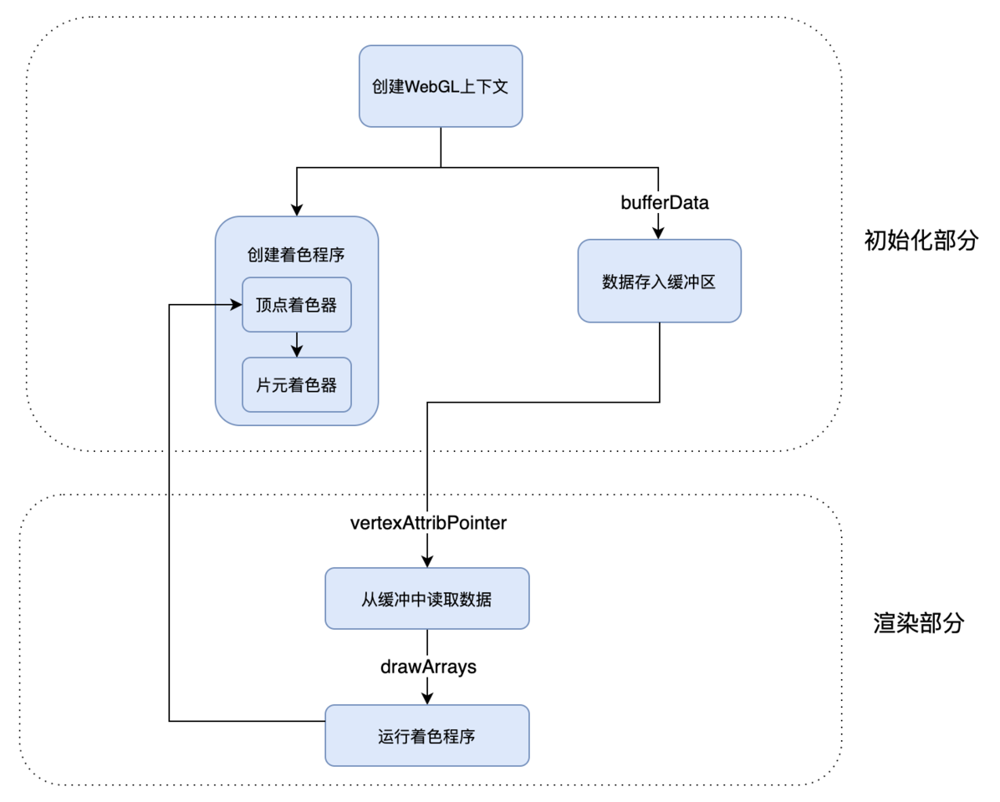

# glsls

`./glsl` 文件夹下有 shader 学习文件

# 配置

## VSC 语法提示

- `cmd + shift + p`，选择 `Configure User Snippets`，选择 `glsl`
- 把 `assets/glsl.json` 拷贝进去

## Clang-Format

```sh
# 安装 clang-format
brew install clang-format

# 查看二进制文件位置
brew info clang-format
```

VSC 安装 `Clang-Format` 插件，配置

```json
{
  "clang-format.executable": "/absolute/path/to/clang-format"
}
```

# 概念

- OpenGL：全称为 Open Graphics Library（开放图形库）。是用于渲染 2D 或 3D 图像的跨语言跨平台的应用程序编程接口
- OpenGL ES：全称为 OpenGL for Embedded Systems（嵌入式系统开放图形库）。OpenGL ES 是 OpenGL 的子集，主要针对嵌入式系统（设备）设计，去除了 Open GL 中非必要的特性
- GLSL：全称为 OpenGL Shading Language（OpenGL 着色语言），是一款在 OpenGL 着色器（Shader）中使用的编程语言
- GLSL ES：全称为 OpenGL ES Shading Language（OpenGL ES 着色语言），就是用于 OpenGL ES 着色器的编程语言

## 像素点

- 一个像素点由四个通道组成，RGBA
- 一个通道是 1byte（字节） = 8bit（比特位）
- 1bit 是计算机最小存储单位，0 或 1

## 顶点着色器

处理顶点的 GPU 程序代码，它可以改变顶点的信息（如顶点的坐标、法线方向、材质等等），从而改变我们绘制出来的图形的形状或者大小等等，顶点着色器大体上可以总结为两个作用：

- 通过 gl_Position 设置顶点
- 通过定义 varying 变量，向片元着色器传递数据

```cpp
// 通过 gl_Position 设置顶点

// 顶点着色器
attribute vec2 position;
void main() {
  gl_PointSize = 1.0;
  gl_Position = vec4(position * 0.5, 1.0, 1.0);
}
```

```cpp
// 定义 varying 变量，向片元着色器传递数据

// 顶点着色器
attribute vec2 position;
varying vec3 color;
void main() {
  gl_PointSize = 1.0;
  color = vec3(0.5 + position * 0.5, 0.0);
  gl_Position = vec4(position * 0.5, 1.0, 1.0);
}

// 片元着色器
precision mediump float;
varying vec3 color;

void main() {
  gl_FragColor = vec4(color, 1.0);
}
```

## 片元着色器

片元着色器：用于处理光栅化后的像素信息，无论有多少个像素点，片元着色器都可以同时处理。从顶点着色器和图元提取像素点给片元着色器执行代码的过程，生成光栅信息的过程

## 坐标系

x 向右、y 向上、z 向屏幕外

## 绘制流程



# 语法

- 1、大小写敏感
- 2、表达式后面必须以`;`结束

## 数据类型

| 类型                    | 说明                                             |
| ----------------------- | ------------------------------------------------ |
| **void**                | 空类型,即不返回任何值                            |
| **bool**                | 布尔类型 true,false                              |
| **int**                 | 带符号的整数 signed integer                      |
| **float**               | 带符号的浮点数 floating scalar                   |
| **vec2, vec3, vec4**    | n 维浮点数向量 n-component floating point vector |
| **bvec2, bvec3, bvec4** | n 维布尔向量 Boolean vector                      |
| **ivec2, ivec3, ivec4** | n 维整数向量 signed integer vector               |
| **mat2, mat3, mat4**    | 2x2, 3x3, 4x4 浮点数矩阵 float matrix            |
| **sampler2D**           | 2D 纹理 a 2D texture                             |
| **samplerCube**         | 盒纹理 cube mapped texture                       |

## 向量的分量

glsl 中的向量(vec2,vec3,vec4)往往有特殊的含义,比如可能代表了一个空间坐标(x,y,z,w),或者代表了一个颜色(r,g,b,a),再或者代表一个纹理坐标(s,t,p,q)

所以 glsl 提供了一些更人性化的分量访问方式

`vector.xyzw` 其中 xyzw 可以任意组合

`vector.rgba` 其中 rgba 可以任意组合

`vector.stpq` 其中 rgba 可以任意组合

```cpp
vec4 v = vec4(1.0,2.0,3.0,1.0);

float x = v.x; //1.0
float x1 = v.r; //1.0
float x2 = v[0]; //1.0

vec3 xyz = v.xyz; //vec3(1.0,2.0,3.0)
vec3 xyz1 = vec(v[0],v[1],v[2]); //vec3(1.0,2.0,3.0)
vec3 rgb = v.rgb; //vec3(1.0,2.0,3.0)

vec2 xyzw = v.xyzw; //vec4(1.0,2.0,3.0,1.0);
vec2 rgba = v.rgba; //vec4(1.0,2.0,3.0,1.0);
```

```cpp
// 鸡尾酒赋值法
vec4 vector;
vector[0] = vector.r = vector.x = vector.s;
vector[1] = vector.g = vector.y = vector.t;
vector[2] = vector.b = vector.z = vector.p;
vector[3] = vector.a = vector.w = vector.q;

vec3 yellow, magenta, green;

// 生成黄色
yellow.rg = vec2(1.0);  // 红色、绿色通道设置为 1.0
yellow[2] = 0.0;        // 蓝色通道设置为 0.0

// 生成品红
magenta = yellow.rbg;   // 绿色和蓝色通道互换

// 生成绿色
green.rgb = yellow.bgb; // 通道颜色可以重复使用
```

## 向量运算


### 平移


### 旋转


### 缩放


## 基础类型运算

| 优先级(越小越高) | 运算符          | 说明                                                            |
| ---------------- | --------------- | --------------------------------------------------------------- |
| 1                | `()`            | 聚组：`a*(b+c)`                                                 |
| 2                | `[]() . ++ --`  | 数组下标 `[]`,属性访问 `a.b`,自增/减后缀 `a++ a--`              |
| 3                | `++ -- + - !`   | 自增/减前缀 `++a --a`, 正负号(一般正号不写)`a ,-a`,取反`!false` |
| 4                | `* /`           | 乘除数学运算                                                    |
| 5                | `+ -`           | 加减数学运算                                                    |
| 7                | `< > <= >=`     | 关系运算符                                                      |
| 8                | `== !=`         | 相等性运算符                                                    |
| 12               | `&&`            | 逻辑与                                                          |
| 13               | `^^`            | 逻辑排他或(用处基本等于!=)                                      |
| 14               | `||`            | 逻辑或                                                          |
| 15               | `? :`           | 三目运算符                                                      |
| 16               | `= += -= *= /=` | 赋值与复合赋值                                                  |
| 17               | `,`             | 顺序分配运算                                                    |

glsl 中没有隐式类型转换，原则上 glsl 要求任何表达式左右两侧(l-value),(r-value)的类型必须一致 也就是说以下表达式都是错误的:

```cpp
int a = 2.0; //错误,r-value为float 而 lvalue 为int.
int a = 1.0+2;
float a = 2;
float a = 2.0+1;
bool a = 0;
vec3 a = vec3(1.0, 2.0, 3.0) * 2;
```

### float 与 int

float 与 float , int 与 int 之间是可以直接运算的,但 float 与 int 不行.它们需要进行一次显示转换.即要么把 float 转成 int: **int(1.0)**，要么把 int 转成 float: **float(1)** ,以下表达式都是正确的:

```cpp
int a = int(2.0);
float a = float(2);

int a = int(2.0)*2 + 1;
float a = float(2)*6.0+2.3;
```

### float 与 vec(向量)、mat(矩阵)

vec,mat 这些类型其实是由 float 复合而成的,当它们与 float 运算时,其实就是在每一个分量上分别与 float 进行运算,这就是【逐分量】运算. glsl 里大部分涉及 vec,mat 的运算都是【逐分量】运算,但也并不全是

【逐分量】运算是线性的,这就是说 vec 与 float 的运算结果是还是 vec.

int 与 vec, mat 之间是不可运算的, 因为 vec 和 mat 中的每一个分量都是 float 类型的. 无法与 int 进行逐分量计算.

下面枚举了几种 float 与 vec,mat 运算的情况

```cpp
vec3 a = vec3(1.0, 2.0, 3.0);
mat3 m = mat3(1.0);
float s = 10.0;
vec3 b = s * a; // vec3(10.0, 20.0, 30.0)
vec3 c = a * s; // vec3(10.0, 20.0, 30.0)
mat3 m2 = s * m; // mat3(10.0)
mat3 m3 = m * s; // mat3(10.0)
```

### vec(向量)与 vec(向量)

两向量间的运算首先要保证操作数的阶数都相同.否则不能计算.例如: `vec3*vec2` `vec4+vec3` 等等都是不行的.

它们的计算方式是两操作数在同位置上的分量分别进行运算,其本质还是【逐分量】进行的,这和上面所说的 float 类型的逐分量运算可能有一点点差异, 相同的是 vec 与 vec 运算结果还是 vec, 且阶数不变.

```cpp
vec3 a = vec3(1.0, 2.0, 3.0);
vec3 b = vec3(0.1, 0.2, 0.3);
vec3 c = a + b; // = vec3(1.1, 2.2, 3.3)
vec3 d = a * b; // = vec3(0.1, 0.4, 0.9)
```

### vec(向量)与 mat(矩阵)

要保证操作数的阶数相同,且 vec 与 mat 间只存在乘法运算.

它们的计算方式和线性代数中的矩阵乘法相同,【不是逐分量】运算.

```cpp
vec2 v = vec2(10.0, 20.0);
mat2 m = mat2(1.0, 2.0, 3.0, 4.0);
vec2 w = m * v; // vec2(1.0 * 10.0 + 3.0 * 20.0, 2.0 * 10.0 + 4.0 * 20.0)

vec2 v = vec2(10.0, 20.0);
mat2 m = mat2(1.0, 2.0, 3.0, 4.0);
vec2 w = v * m; // vec2(1.0 * 10.0 + 2.0 * 20.0, 3.0 * 10.0 + 4.0 * 20.0)
```

向量与矩阵的乘法规则如下:


### mat(矩阵)与 mat(矩阵)

要保证操作数的阶数相同.

在 mat 与 mat 的运算中, 除了乘法是线性代数中的矩阵乘法外.其余的运算任为逐分量运算.简单说就是只有乘法是特殊的,其余都和 vec 与 vec 运算类似.

```cpp
mat2 a = mat2(1.0, 2.0, 3.0, 4.0);
mat2 b = mat2(10.0, 20.0, 30.0, 40.0);
mat2 c = a * b; // mat2(1.0*10.0+3.0*20.0, 2.0*10.0+4.0*20.0, 1.0* 30.0+3.0*40.0, 2.0* 30.0+4.0*40.0);
mat2 d = a+b; // mat2(1.0+10.0,2.0+20.0,3.0+30.0,4.0+40);
```

矩阵乘法规则如下:


## 限定符

| 修饰符      | 说明                                                                                                 |
| ----------- | ---------------------------------------------------------------------------------------------------- |
| `none`      | (默认的可省略)本地变量,可读可写,函数的输入参数既是这种类型                                           |
| `const`     | 声明变量或函数的参数为只读类型                                                                       |
| `attribute` | 只能存在于 vertex shader 中,一般用于保存顶点或法线数据,它可以在数据缓冲区中读取数据                  |
| `uniform`   | 在运行时 shader 无法改变 uniform 变量, 一般用来放置程序传递给 shader 的变换矩阵，材质，光照参数等等. |
| `varying`   | 主要负责在 vertex 和 fragment 之间传递变量                                                           |

### const

和 C 语言类似,被 const 限定符修饰的变量初始化后不可变,除了局部变量,函数参数也可以使用 const 修饰符.但要注意的是结构变量可以用 const 修饰, 但结构中的字段不行.

const 变量必须在声明时就初始化 `const vec3 v3 = vec3(0.,0.,0.)`

局部变量只能使用 const 限定符.

函数参数只能使用 const 限定符.

```cpp
struct light {
        vec4 color;
        vec3 pos;
        //const vec3 pos1; //结构中的字段不可用 const 修饰会报错.
    };
const light lgt = light(vec4(1.0), vec3(0.0)); // 结构变量可以用 const 修饰
```

### attribute

attribute 变量是`全局`且`只读`的，它只能在 vertex shader 中使用，只能与浮点数、向量或矩阵变量组合，一般 attribute 变量用来放置程序传递来的模型顶点,法线,颜色,纹理等数据，它可以访问数据缓冲区(还记得`gl.vertexAttribPointer`这个函数吧)

```cpp
attribute vec4 a_Position;
```

### uniform

uniform 变量是`全局`且`只读`的，在整个 shader 执行完毕前其值不会改变，他可以和任意基本类型变量组合，一般我们使用 uniform 变量来放置外部程序传递来的环境数据(如点光源位置,模型的变换矩阵等等)，这些数据在运行中显然是不需要被改变的

```cpp
uniform vec4 lightPosition;
```

### varying

varying 类型变量是 vertex shader 与 fragment shader 之间的信使，一般我们在 vertex shader 中修改它然后在 fragment shader 使用它，但不能在 fragment shader 中修改它

```cpp
// 顶点着色器
varying vec4 v_Color;
void main(){
  v_Color = vec4(1.0, 1.0, 1.0, 1.0);
}

// 片元着色器
varying vec4 v_Color;
void main() {
  gl_FragColor = v_Color;
}
```

要注意全局变量限制符只能为 const、attribute、uniform 和 varying 中的一个，不可复合

## 内置函数

glsl 提供了非常丰富的函数库,供我们使用,这些功能都是非常有用且会经常用到的. 这些函数按功能区分大改可以分成 7 类:

### 通用函数

下文中的 类型 T 可以是 float, vec2, vec3, vec4,且可以逐分量操作.

```cpp
T abs(T x) // 返回 x 的绝对值

T sign(T x) // 比较 x 与 0 的值,大于,等于,小于 分别返回 1.0 ,0.0,-1.0

T floor(T x) // 返回 <=x 的最大整数

T ceil(T x) // 返回 <=x 的最大整数

T fract(T x) // 获取 x 的小数部分

T mod(T x, float y) // 取 x,y 的余

T min(T x, float y) // 取 x,y 的最小值

T max(T x, float y) // 取 x,y 的最大值

T clamp(T x, float minVal, float maxVal) // min(max(x, minVal), maxVal),返回值被限定在 minVal,maxVal 之间

T mix(T x, T y, float a) // 取 x,y 的线性混合,x*(1-a) + y*a

T step(float edge, T x) // x < edge 返回 0.0 否则返回 1.0

T smoothstep(float edge0, float edge1, T x) // 如果 x < edge0 返回 0.0 如果 x > edge1 返回 1.0, 否则返回 Hermite 插值
```

### 角度&三角函数

下文中的 类型 T 可以是 float, vec2, vec3, vec4,且可以逐分量操作.

```cpp
T radians(T degrees) // 角度转弧度
T degrees(T radians) // 弧度转角度
T sin(T angle) // 正弦函数,角度是弧度
T cos(T angle) // 余弦函数,角度是弧度
T tan(T angle) // 正切函数,角度是弧度
T asin(T x)  // 反正弦函数,返回值是弧度
T acos(T x)  // 反余弦函数,返回值是弧度
T atan(T y_over_x) // 反正切函数,返回值是弧度
```

### 指数函数

下文中的 类型 T 可以是 float, vec2, vec3, vec4,且可以逐分量操作.

```cpp
T pow(T x, T y) // 返回 x 的 y 次幂，x<sub>y</sub>

T exp(T x) // 返回 x 的自然指数幂，e<sub>x</sub>

T log(T x) // 返回 x 的自然对数 ln

T exp2(T x) // 返回 2 的 x 次幂 2<sub>x</sub>

T log2(T x) // 返回 2 为底的对数 log2

T sqrt(T x) // 开根号 √x

T inversesqrt(T x) // 先开根号,在取倒数,就是 1/√x
```

### 几何函数

下文中的 类型 T 可以是 float, vec2, vec3, vec4,且可以逐分量操作.

```cpp
float length(T x) // 返回矢量 x 的长度

float distance(T p0, T p1) // 返回 p0 p1 两点的距离

float dot(T x, T y) // 返回 x y 的点积

vec3 cross(vec3 x, vec3 y) // 返回 x y 的叉积

T normalize(T x) // 对 x 进行归一化,保持向量方向不变但长度变为 1

T faceforward(T N, T I, T Nref) // 根据 矢量 N 与 Nref 调整法向量

T reflect(T I, T N) // 返回 I - 2 _ dot(N,I) _ N, 结果是入射矢量 I 关于法向量 N 的 镜面反射矢量

T refract(T I, T N, float eta) // 返回入射矢量 I 关于法向量 N 的折射矢量,折射率为 eta
```

### 矩阵函数

```cpp
mat matrixCompMult(mat x, mat y) // 将矩阵 x 和 y 的元素逐分量相乘
```

### 向量函数

下文中的 类型 T 可以是 vec2, vec3, vec4, 且可以逐分量操作.

bvec 指的是由 bool 类型组成的一个向量:

```cpp
vec3 v3= vec3(0.,0.,0.);
vec3 v3_1= vec3(1.,1.,1.);
bvec3 aa= lessThan(v3,v3_1); //bvec3(true,true,true)

bvec lessThan(T x, T y) // 逐分量比较 x < y,将结果写入 bvec 对应位置

bvec lessThanEqual(T x, T y) // 逐分量比较 x <= y,将结果写入 bvec 对应位置

bvec greaterThan(T x, T y) // 逐分量比较 x > y,将结果写入 bvec 对应位置

bvec greaterThanEqual(T x, T y) // 逐分量比较 x >= y,将结果写入 bvec 对应位置

bvec equal(T x, T y) // 逐分量比较 x == y,将结果写入 bvec 对应位置

bvec notEqual(T x, T y) // 逐分量比较 x!= y,将结果写入 bvec 对应位置

bool any(bvec x) // 如果 x 的任意一个分量是 true,则结果为 true

bool all(bvec x) // 如果 x 的所有分量是 true,则结果为 true

bvec not(bvec x) // bool 矢量的逐分量取反
```

### 纹理查询函数

图像纹理有两种 一种是平面 2d 纹理,另一种是盒纹理,针对不同的纹理类型有不同访问方法.

纹理查询的最终目的是从 sampler 中提取指定坐标的颜色信息. 函数中带有 Cube 字样的是指 需要传入盒状纹理. 带有 Proj 字样的是指带投影的版本.

```cpp
// 以下函数只在 vertex shader 中可用
vec4 texture2DLod(sampler2D sampler, vec2 coord, float lod);
vec4 texture2DProjLod(sampler2D sampler, vec3 coord, float lod);
vec4 texture2DProjLod(sampler2D sampler, vec4 coord, float lod);
vec4 textureCubeLod(samplerCube sampler, vec3 coord, float lod);
```

```cpp
// 以下函数只在 fragment shader 中可用
vec4 texture2D(sampler2D sampler, vec2 coord, float bias);
vec4 texture2DProj(sampler2D sampler, vec3 coord, float bias);
vec4 texture2DProj(sampler2D sampler, vec4 coord, float bias);
vec4 textureCube(samplerCube sampler, vec3 coord, float bias);
```

```cpp
// 在 vertex shader 与 fragment shader 中都可用:
vec4 texture2D(sampler2D sampler, vec2 coord);
vec4 texture2DProj(sampler2D sampler, vec3 coord);
vec4 texture2DProj(sampler2D sampler, vec4 coord);
vec4 textureCube(samplerCube sampler, vec3 coord);
```

## 函数

glsl 允许在程序的最外部声明函数.函数不能嵌套,不能递归调用,且必须声明返回值类型(无返回值时声明为 void) 在其他方面 glsl 函数与 c 函数非常类似.

```cpp
vec4 getPosition(){
    vec4 v4 = vec4(0.,0.,0.,1.);
    return v4;
}

void doubleSize(inout float size){
    size= size*2.0  ;
}
void main() {
    float psize= 10.0;
    doubleSize(psize);
    gl_Position = getPosition();
    gl_PointSize = psize;
}
```

- 如果函数有返回值，就需要指定返回值的类型，如果没有返回值，必须指定为空 void
- 如果函数有参数，那么也需要指定参数的类型

```cpp
// 没有返回值没有参数的 main 函数
void main() {
    // ...
}
// 接收两个 int 类型参数并返回 int 类型的值的 sum 函数
int sum(int a, int b) {
    return a + b;
}

// 可以声明多次但是只允许定义一次
void foo(); // 首次声明
void foo(); // 允许重复声明
void foo() { ... } // 定义

// 重载函数允许你传入不同数量或不同类型的参数
void foo(int value) { ... }
void foo(float value) { ... }
void foo(float value1, int value2) { ... }
```

### 作用域

```cpp
// 使用一对花括号{}包裹的区域即为一个作用域
void foo() {
    int a = 0;
    {
        int b = 0;
    }
}

// 子域可以访问父域的成员
void foo(int a) {
    {
        int a = a + 1; // 第二个 a 属于父域，不冲突
        int b = a; // 访问当前作用域的 a
    }
    int c = b; // Error! 当前作用域内不存在 b
    int d = a; // 当前作用域的参数 a
}

// 同一作用域内不允许成员名称重复
int age; // 声明为整型
float age; // Error! 冲突
void age(); // Error! 冲突
```

### 运算符

- `++` `--`：自增、自减
- `+` `-` `~` `!` ：一元运算
- `*` `%` `/`：乘、取余、除
- `+` `-`： 加、减
- `<` `>` `<=` `>=` `==` `!=`：关系运算
- `&&` `^^` `||`：逻辑与、逻辑异或、逻辑同或
- `?:`：三目运算

### 限定符

函数的参数默认是以拷贝的形式传递的,也就是值传递,任何传递给函数参数的变量,其值都会被复制一份,然后再交给函数内部进行处理.
我们可以为参数添加限定符来达到传递引用的目的,glsl 中提供的参数限定符如下:

| 限定符            | 说明                           |
| ----------------- | ------------------------------ |
| < none: default > | 默认使用 in 限定符             |
| in                | 复制到函数中在函数中可读写     |
| out               | 返回时从函数中复制出来         |
| inout             | 复制到函数中并在返回时复制出来 |

`in` 是函数参数的默认限定符,最终真正传入函数形参的其实是实参的一份拷贝.在函数中,修改 in 修饰的形参不会影响到实参变量本身.

`out` 它的作用是向函数外部传递新值,out 模式下传递进来的参数是 write-only 的(可写不可读).就像是一个"坑位",坑位中的值需要函数给他赋予.
在函数中,修改 out 修饰的形参会影响到实参本身.

`inout` inout 下,形参可以被理解为是一个带值的"坑位",及可读也可写,在函数中,修改 inout 修饰的形参会影响到实参本身.

#### 储存限定符

声明变量时可以在类型前面添加一个储存限定符

```cpp
// const

// 使用 const 限定符修饰的变量即为常量，常量一但定义就不可再修改
// 适用于标量、向量、矩阵、数组和结构体，但不适用于采样器

const int age = 18;
const vec4 color = vec4(0.5, 0.5, 0.5, 0.5);
// 也可以用于限定函数的参数
void doSomething(const float param) {
    param = 0.1; // Error! 不可！
    // ...
}
```

```cpp
// in

// in 限定符常用于接收从上一阶段输出的变量

in vec3 a_position; // 接收一个顶点坐标向量
in vec2 a_uv0; // 接收一个纹理坐标向量
in vec4 a_color; // 接受一个颜色向量
```

```cpp
// out

// out 限定符常用于将当前着色器中的变量输出到下一阶段

out vec2 v_uv0; // 输出一个纹理坐标向量
out vec4 v_color; // 输出一个颜色向量
```

```cpp
// uniform

// 使用 uniform 限定符来表示一个统一且只读的全局变量，该变量为所有着色器所共用
// 声明了却没有使用的 uniform 变量会在编译时被静默移除

uniform sampler2D texture;

// uniform 变量只能在程序中使用 OpenGL ES 的一系列 glUniform API 进行赋值
// 程序代码
int location = glGetUniformLocation(shaderProgram, "color"); // 查找 color 的位置（索引）
glUniform4f(location, 0.0f, 0.1f, 0.0f, 1.0f); // 给 color 赋值
// 着色器代码
uniform vec4 color; // vec4(0.0, 0.1, 0.0, 1.0)
```

#### 参数限定符

```cpp
// in
// 表示复制进函数体内的参数（值传递，不影响原来的值）
void doo(in float param) { ... } // 和普通不加限定词的参数一样

// out
// 表示函数向外复制的参数，必须是之前未被初始化的变量（引用传递，会影响原来的值）
void foo(out int param) {
    param = 666;
}
int a; // 声明了但是没有初始化
foo(a); // a = 666

// inout
// 表示参数将在函数内外保持一致（引用传递，会影响原来的值）
void goo(inout int param) {
    param = param++;
}
int b = 1;
goo(b); // b = 2
```

#### 精度限定符

浮点数、整数和采样器类型声明可以添加精度限定词来设置精度范围（精度控制可以扩展至向量和矩阵）

```cpp
// highp 满足顶点语言的最低要求（使用 highp 可以获得最大的范围和精度，但是也有可能会降低运行速度）
// mediump 范围和精度介于 highp 和 lowp 之间（通常用于储存高范围的颜色数据和低精度的几何数据）
// lowp 范围和精度比 meduimp 小，但是足以储存所有 8-bit 颜色数据

// 变量声明
lowp float a;
mediump vec2 p;
highp mat4 m;

// 函数声明（返回值和参数）也适用
highp float foo(highp param);

// 用 precision 关键字来声明指定类型的默认精度
// 声明 float 类型的默认精度为 highp
precision highp float;

// 在「未主动声明精度」的情况下
// 在顶点着色器中有以下默认精度声明
precision highp float;
precision highp int;
precision lowp sampler2D;
precision lowp samplerCube;
// 片段着色器中有以下默认精度声明
precision mediump int;
precision lowp sampler2D;
precision lowp samplerCube;
// 在片段着色器中浮点类型、浮点向量和浮点矩阵都没有默认的精度，所以使用时就必须声明其精度，或者事先声明默认精度
```

## 数据类型

### 标量（Scalar）

标量表示只有大小没有方向的量

```cpp
// 整型
int age = 18;
// 无符号整型，在数字后面加 u
uint hello = 3u;
// 浮点型
float pi = 3.14;
// 布尔型
bool isMe = true;
```

```cpp
// 类型转换

int a = 1;

float b = float(a); // 1.0

// float 类型的值转换为 int 和 uint 时小数点后面的值将会被忽略
// 负的 float 类型的值不能转换为 uint 类型
int c = int(b); // 1

uint d = uint(c); // 1u
// 当 int、uint 或 float 类型的值转换为 bool 类型时
// 0 或 0.0 将会被转换为 false，所有非零的值都会被转换为 true
bool e = bool(d); // true

// 当 bool 类型的值转换为 int、uint 或 float 类型时
// false 将会被转换为 0 或 0.0，true 会被转换为 1 或 1.0
int f = int(e); // 1

// 将非标量值转换为标量值时，实际处理的将会是非标量值的第一个元素
vec3 a = vec3(0.1, 0.2, 0.3);
float b = float(a); // 0.1
```

### 向量（Vector）

在 GLSL 中向量一般用于储存顶点坐标、颜色或纹理坐标数据，一个向量可以包含 2 到 4 个分量（Component）

#### 创建向量

一般情况下使用浮点（float）型 `vecn`，n 为分量的个数

```cpp
// 含有 2 个 float 类型分量的向量
vec2 coord = vec2(0.5, 0.5);
// 含有 3 个 int 类型分量的向量
ivec3 police = ivec3(1, 1, 0);
// 含有 4 个 bool 类型分量的向量
bvec4 hello = bvec4(true, false, true, false);

// 只传入一个参数的情况下会自动将其他值也设为第一个参数
vec3 three = vec3(0.1); // 等同于 vec3(0.1, 0.1, 0.1)

// 使用一个向量作为参数传给另一个向量构造函数
vec2 two = vec2(0.1, 0.2);
vec3 three = vec3(two, 0.3); // vec3(0.1, 0.2, 0.3)

// 将“大”向量作为参数来创建“小”向量（降维）会自动抛弃多余的值
vec4 four = vec4(0.1, 0.2, 0.3, 0.4);
vec3 three = vec3(four); // 等同于 vec3(0.1, 0.2, 0.3)，抛弃了 0.4
```

#### 使用分量

通过分量名来获取向量中的第 1 到第 4 个分量，所有向量都可以使用：

- xyzw（顶点坐标向量）
- rgba（颜色向量）
- stpq （纹理坐标向量）

为了代码的严谨性和可读性，使用相应的分量名

```cpp
// 顶点坐标
vec2 coord = vec2(1.0, 0.5);
float x = coord.x; // 1.0
float y = coord.y; // 0.5
float z = coord.z; // Error! 不存在

// 颜色
vec4 color = vec4(0.6, 0.8, 1,0, 0.5);
float r = color.r; // 0.6
float a = color.a; // 0.5
// 纹理坐标
vec4 texCoord = vec4(0.2, 0.4, 0.6, 0.8);
float t = texCoord.t; // 0.4
float p = texCoord.p; // 0.6
```

#### 重组分量

使用同一组分量名的任意组合来创建一个新的向量

```cpp
vec4 coord = vec4(0.1, 0.2, 0.3, 0.4);
vec2 one = coord.xx; // vec2(0.1, 0.1)
vec2 two = coord.xy; // vec2(0.1, 0.2)
vec3 three = coord.xzw; // vec3(0.1, 0.3, 0.4)
vec4 four = coord.wzyx; // vec4(0.4, 0.3, 0.2, 0.1)
vec4 boom = coord.xyzw + coord.wzyx; // vec4(0.5, 0.5, 0.5, 0.5)
vec4 hello = vec4(coord.zyx, 0.0); // vec4(0.3, 0.2, 0.1, 0.0)
```

### 矩阵（Matrix）

矩阵最多能够支持 4 列 4 行的数据，最少 2 行 2 列，且其元素只能够为 float 类型

- `matn` 表示 n 列 n 行的浮点型矩阵，例如 `mat2`、`mat3`、`mat4`
- `matmxn` 表示 m 列 n 行的浮点型矩阵，例如 `mat2x3`、`mat4x3`

```cpp
// 创建一个 2x2 的矩阵
mat2 two = mat2(
    0.1, 0.2, // 第一列
    0.3, 0.4); // 第二列

// 创建一个 3x3 的矩阵
mat3 three = mat3(0.1, 0.2, 0.3, // 第一列
                  0.4, 0.5, 0.6, // 第二列
                  0.7, 0.8, 0.9); // 第三列

// 只传入一个参数的情况下会自动补零
mat2 two = mat2(1.0); // 等同于 mat2(1.0, 0.0, 0.0, 0.0)

// 传入向量来创建矩阵
vec2 a = vec2(1.0, 0.0);
vec2 b = vec2(0.5, 0.1);
mat2 four = mat2(a, b); // 等同于 mat2(1.0, 0.0, 0.5, 0.1)
```

```cpp
mat3 three = mat3(0.1, 0.2, 0.3, // 第一列
                  0.4, 0.5, 0.6, // 第二列
                  0.7, 0.8, 0.9); // 第三列
float el = three[0][2]; // 获取第一列第三行的元素：0.3
```

### 采样器（Sampler）

通过采样器来获取纹理的信息

采样器只能在 Shader 外部的宿主语言中通过 OpenGL 的 API 来进行赋值

- smapler2D：用来访问 2D 纹理的句柄
- sampler3D：用来访问 3D 纹理的句柄

```cpp
// 采样器必须使用 uniform 关键字来修饰
uniform sampler2D myTexture;

// 通过内置的 texture 函数获取 myTexture 纹理 uv_0 坐标处的颜色
vec4 color = texture(myTexture, uv_0);
```

### 结构体（Structure）

使用 struct 关键字来自定义一个新的类型，新的自定义类型可以包含其他已经定义的类型

```cpp
// 定义一个名为 circle 的类型，包含一个浮点型成员和一个四维向量成员
struct circle {
    float radius;
    vec4 color;
};
// 创建一个 circle 类型的变量
circle myCircle;
// 单独给 radius 赋值
myCircle.radius = 0.5;
```

### 数组（Array）

在变量名称后面接上一对方括号 `[]` 就是数组

```cpp
// 字面量数组
float a[3] = float[3](0.1, 0.2, 0.3);
float b = a[1]; // 0.2

// 返回值类型
float[5] getValues() { ... }
// 参数类型
void setValues(float[2] values) { ... }
```

## 迭代

### 循环语句

```cpp
// for

int a = 0;
for (int i = 0; i < 10; i++) {
    a++;
}
// a = 10
```

```cpp
// while

int a = 0;
while (a < 10) {
    a++;
}
// a = 10
```

```cpp
// do-while
// 先执行一次循环体，之后只要条件表达式为 true 就继续执行循环体，直到条件表达式为 false 时结束循环

int a = 0;
do {
    a++;
} while (a < 0)
// a = 1;
```

### 选择语句

```cpp
// if

int a = 0;
if (a == 0) {
    a++;
}
// a = 1
```

```cpp
// if-else

int a = 0;
if (a == 1) {
    a++;
} else {
    a += 2;
}
// a = 2
```

```cpp
// switch
// switch 语句中的初始化表达式必须为整数，如果 case 标签的值与之相等，则执行标签后面的语句

int a = 2;
switch (a) {
    case 1:
        a += 1;
        break;
    case 2:
        a += 2;
        break;
    default:
        a += 10;
}
// a = 4
```

### 跳转语句

```cpp
// continue
// 只可用于循环中，执行该语句时会跳过最内层循环，然后执行下一次循环

int a = 0;
for (int i = 0; i < 10; i++) {
    if (i == 6) {
        continue;
        // 当 i 为 6 时不会执行后面的语句
    }
    a++;
}
// a = 9
```

```cpp
// break
// 可用于循环和 switch 语句中，执行该语句时将立即退出最内层循环，不再继续执行循环

int a = 0;
for (int i = 0; i < 10; i++) {
    if (i == 6) {
        break;
        // 当 i 为 6 时直接跳出循环
    }
    a++;
}
// a = 6
```

```cpp
// return
// 可以用在函数（Function）里的任何位置，执行该语句会直接跳出当前函数

int plus(int a, int b) {
    return a + b;
}
int c = plus(1, 2);
// c = 3
```

```cpp
// discard
// 只能在片元着色器（Fragment Shader）中使用，执行该语句将会直接跳出片元着色器，丢弃当前片元

void main() {
    if (v_FragColor.a < 0.1) {
        discard;
        // 不透明度小于 0.1 时丢弃当前片元
        // 不执行后面的语句
    }
    gl_FragColor = v_FragColor;
}
```

### 精度设置

glsl 在进行光栅化着色的时候,会产生大量的浮点数运算,这些运算可能是当前设备所不能承受的,所以 glsl 提供了 3 种浮点数精度,我们可以根据不同的设备来使用合适的精度.

在变量前面加上 `highp` `mediump` `lowp` 即可完成对该变量的精度声明.

```
lowp float color;
varying mediump vec2 Coord;
lowp ivec2 foo(lowp mat3);
highp mat4 m;
```

我们一般在片元着色器(fragment shader)最开始的地方加上 `precision mediump float;` 便设定了默认的精度.这样所有没有显式表明精度的变量都会按照设定好的默认精度来处理

**如何确定精度:**

变量的精度首先是由精度限定符决定的,如果没有精度限定符,则要寻找其右侧表达式中,已经确定精度的变量,一旦找到,那么整个表达式都将在该精度下运行.如果找到多个,
则选择精度较高的那种,如果一个都找不到,则使用默认或更大的精度类型.

```cpp
uniform highp float h1;
highp float h2 = 2.3 * 4.7; //运算过程和结果都 是高精度
mediump float m;
m = 3.7 * h1 * h2; //运算过程 是高精度
h2 = m * h1; //运算过程 是高精度
m = h2 – h1; //运算过程 是高精度
h2 = m + m; //运算过程和结果都 是中等精度
void f(highp float p); // 形参 p 是高精度
f(3.3); //传入的 3.3是高精度
```

**invariant 关键字:**

由于 shader 在编译时会进行一些内部优化,可能会导致同样的运算在不同 shader 里结果不一定精确相等.这会引起一些问题,尤其是 vertx shader 向 fragmeng shader 传值的时候.
所以我们需要使用`invariant` 关键字来显式要求计算结果必须精确一致. 当然我们也可使用 `#pragma STDGL invariant(all)`来命令所有输出变量必须精确一致,
但这样会限制编译器优化程度,降低性能.

```cpp
#pragma STDGL invariant(all) //所有输出变量为 invariant
invariant varying texCoord; //varying在传递数据的时候声明为invariant
```

**限定符的顺序:**

当需要用到多个限定符的时候要遵循以下顺序:

1.在一般变量中: invariant > storage > precision

2.在参数中: storage > parameter > precision

我们来举例说明:

```cpp
invariant varying lowp float color; // invariant > storage > precision

void doubleSize(const in lowp float s){ //storage > parameter > precision
    float s1=s;
}
```

## 预编译指令

以 # 开头的是预编译指令,常用的有:

```cpp
#define
#undef
#if
#ifdef
#ifndef
#else
#elif
#endif
#error
#pragma
#extension
#version
#line
```

比如 **\#version 100** 他的意思是规定当前 shader 使用 GLSL ES 1.00 标准进行编译,如果使用这条预编译指令,则他必须出现在程序的最开始位置.

**内置的宏:**

`__LINE__` : 当前源码中的行号.

`__VERSION__` : 一个整数,指示当前的 glsl 版本 比如 100 ps: 100 = v1.00

`GL_ES` : 如果当前是在 OPGL ES 环境中运行则 GL_ES 被设置成 1,一般用来检查当前环境是不是 OPENGL ES.

`GL_FRAGMENT_PRECISION_HIGH` : 如果当前系统 glsl 的片元着色器支持高浮点精度,则设置为 1.一般用于检查着色器精度.

实例:

1.如何通过判断系统环境,来选择合适的精度:

```cpp
#ifdef GL_ES //
#ifdef GL_FRAGMENT_PRECISION_HIGH
precision highp float;
#else
precision mediump float;
#endif
#endif

```

2.自定义宏:

```cpp
#define NUM 100
#if NUM==100
#endif
```

## 内置特殊变量

glsl 程序使用一些特殊的内置变量与硬件进行沟通.他们大致分成两种 一种是 `input`类型,他负责向硬件(渲染管线)发送数据.
另一种是`output`类型,负责向程序回传数据,以便编程时需要.

**在 vertex Shader 中:**

output 类型的内置变量:

| 变量                          | 说明                                                      | 单位  |
| ----------------------------- | --------------------------------------------------------- | ----- |
| highp vec4 `gl_Position`;     | gl_Position 放置顶点坐标信息                              | vec4  |
| mediump float `gl_PointSize`; | gl_PointSize 需要绘制点的大小,(只在 gl.POINTS 模式下有效) | float |

**在 fragment Shader 中:**

input 类型的内置变量:

| 变量                          | 说明                                           | 单位 |
| ----------------------------- | ---------------------------------------------- | ---- |
| mediump vec4 `gl_FragCoord`;  | 片元在 framebuffer 画面的相对位置              | vec4 |
| bool `gl_FrontFacing`;        | 标志当前图元是不是正面图元的一部分             | bool |
| mediump vec2 `gl_PointCoord`; | 经过插值计算后的纹理坐标,点的范围是 0.0 到 1.0 | vec2 |

output 类型的内置变量:

| 变量                          | 说明                                           | 单位            |
| ----------------------------- | ---------------------------------------------- | --------------- |
| mediump vec4 `gl_FragColor`;  | 设置当前片点的颜色                             | vec4 RGBA color |
| mediump vec4 `gl_FragData[n]` | 设置当前片点的颜色,使用 glDrawBuffers 数据数组 | vec4 RGBA color |

## 内置常量

glsl 提供了一些内置的常量,用来说明当前系统的一些特性. 有时我们需要针对这些特性,对 shader 程序进行优化,让程序兼容度更好.

**在 vertex Shader 中:**

1.const mediump int `gl_MaxVertexAttribs`>=8

gl_MaxVertexAttribs 表示在 vertex shader(顶点着色器)中可用的最大 attributes 数.这个值的大小取决于 OpenGL ES 在某设备上的具体实现,不过最低不能小于 8 个.

2.const mediump int `gl_MaxVertexUniformVectors` >= 128

gl_MaxVertexUniformVectors 表示在 vertex shader(顶点着色器)中可用的最大 uniform vectors 数. 这个值的大小取决于 OpenGL ES 在某设备上的具体实现,不过最低不能小于 128 个.

3.const mediump int `gl_MaxVaryingVectors` >= 8

gl_MaxVaryingVectors 表示在 vertex shader(顶点着色器)中可用的最大 varying vectors 数. 这个值的大小取决于 OpenGL ES 在某设备上的具体实现,不过最低不能小于 8 个.

4.const mediump int `gl_MaxVertexTextureImageUnits` >= 0

gl_MaxVaryingVectors 表示在 vertex shader(顶点着色器)中可用的最大纹理单元数(贴图). 这个值的大小取决于 OpenGL ES 在某设备上的具体实现,甚至可以一个都没有(无法获取顶点纹理)

5.const mediump int `gl_MaxCombinedTextureImageUnits` >= 8

gl_MaxVaryingVectors 表示在 vertex Shader 和 fragment Shader 总共最多支持多少个纹理单元. 这个值的大小取决于 OpenGL ES 在某设备上的具体实现,不过最低不能小于 8 个.

**在 fragment Shader 中:**

1.const mediump int `gl_MaxTextureImageUnits` >= 8

gl_MaxVaryingVectors 表示在 fragment Shader(片元着色器)中能访问的最大纹理单元数,这个值的大小取决于 OpenGL ES 在某设备上的具体实现,不过最低不能小于 8 个.

2.const mediump int `gl_MaxFragmentUniformVectors` >= 16

gl_MaxFragmentUniformVectors 表示在 fragment Shader(片元着色器)中可用的最大 uniform vectors 数,这个值的大小取决于 OpenGL ES 在某设备上的具体实现,不过最低不能小于 16 个.

3.const mediump int `gl_MaxDrawBuffers` = 1

gl_MaxDrawBuffers 表示可用的 drawBuffers 数,在 OpenGL ES 2.0 中这个值为 1, 在将来的版本可能会有所变化.

glsl 中还有一种内置的 uniform 状态变量, `gl_DepthRange` 它用来表明全局深度范围.

结构如下:

```cpp
struct gl_DepthRangeParameters {
 highp float near; // n
 highp float far; // f
 highp float diff; // f - n
 };
 uniform gl_DepthRangeParameters gl_DepthRange;

```

除了 gl_DepthRange 外的所有 uniform 状态常量都已在 glsl 1.30 中`废弃`.

## 流控制

glsl 的流控制和 c 语言非常相似,这里不必再做过多说明,唯一不同的是片段着色器中有一种特殊的控制流`discard`.
使用 discard 会退出片段着色器，不执行后面的片段着色操作。片段也不会写入帧缓冲区。

```cpp
for (l = 0; l < numLights; l++)
{
    if (!lightExists[l]);
        continue;
    color += light[l];
}
...

while (i < num)
{
    sum += color[i];
    i++;
}
...

do{
    color += light[lightNum];
    lightNum--;
}while (lightNum > 0)


...

if (true)
    discard;


```

# 校验成果

```cpp
// Vertex Shader
uniform mat4 mvp_matrix; // 透视矩阵 * 视图矩阵 * 模型变换矩阵
uniform mat3 normal_matrix; // 法线变换矩阵(用于物体变换后法线跟着变换)
uniform vec3 ec_light_dir; // 光照方向
attribute vec4 a_vertex; // 顶点坐标
attribute vec3 a_normal; // 顶点法线
attribute vec2 a_texcoord; // 纹理坐标
varying float v_diffuse; // 法线与入射光的夹角
varying vec2 v_texcoord; // 2d纹理坐标
void main(void) {
 // 归一化法线
 vec3 ec_normal = normalize(normal_matrix * a_normal);
 // v_diffuse 是法线与光照的夹角.根据向量点乘法则,当两向量长度为1是 乘积即cosθ值
 v_diffuse = max(dot(ec_light_dir, ec_normal), 0.0);
 v_texcoord = a_texcoord;
 gl_Position = mvp_matrix * a_vertex;
}
```

```cpp
// Fragment Shader
precision mediump float;
uniform sampler2D t_reflectance;
uniform vec4 i_ambient;
varying float v_diffuse;
varying vec2 v_texcoord;
void main (void) {
 vec4 color = texture2D(t_reflectance, v_texcoord);
 // 这里分解开来是 color*vec3(1,1,1)*v_diffuse + color*i_ambient
 // 色*光*夹角cos + 色*环境光
 gl_FragColor = color*(vec4(v_diffuse) + i_ambient);
}
```

# 参考资料

- [thebookofshaders](https://thebookofshaders.com/01/?lan=ch)
- [极客时间-跟月影学可视化](https://time.geekbang.org/column/intro/320)
- [WebGL 纹理详解](https://zhuanlan.zhihu.com/p/68894334)
- [awesome-glsl](https://github.com/radixzz/awesome-glsl)
- [GLSL 中文手册](https://github.com/wshxbqq/GLSL-Card)
- [函数详细解释](https://thebookofshaders.com/glossary/?search=sin)
- [函数可视化](https://graphtoy.com/)
- [缓动函数](https://easings.net/)
