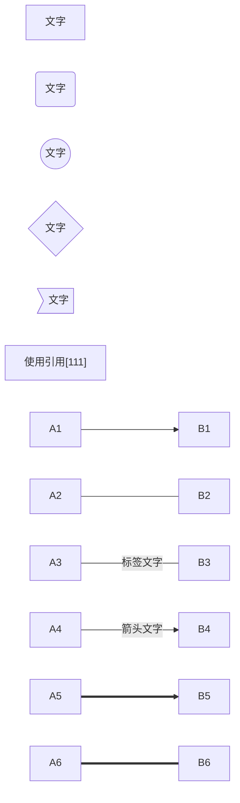
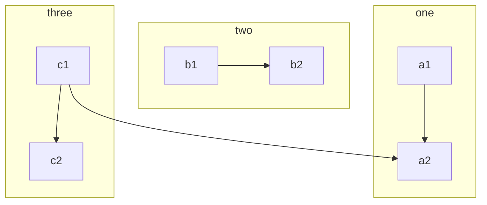
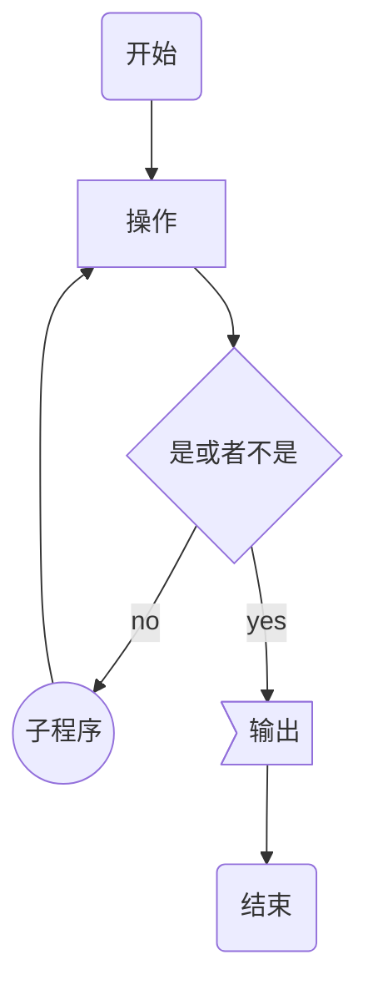
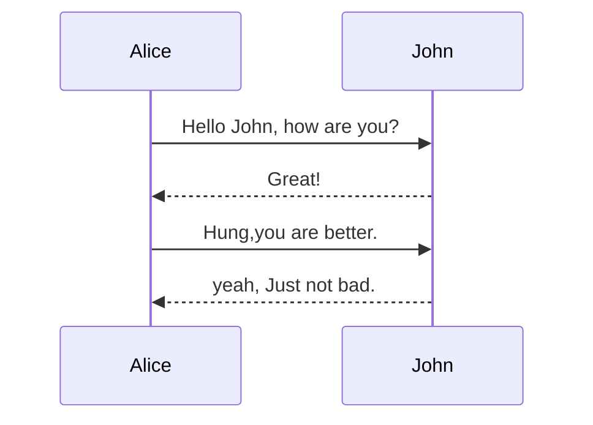

Mermaid 是一个用于画流程图、状态图、时序图、甘特图的库，使用 JS 进行本地渲染，广泛集成于许多 Markdown 编辑器中

## 流程图 graph

- TB：top bottom；LR：left right

### 基本语法

### 子图

### 实例

## 时序图 sequenceDiagram

- 设定参与者(participants)的顺序控制二者的顺序

