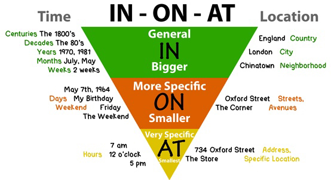

# 单词

- 900单词，9000组合
- 单词必须要 anchor，要跟情感锚定起来
- 发音都是声母+韵母

## 介词

### 方位介词

```sh
# 某地
She arrives in Australia # in 大地点
She arrives at the bus stop # at 小地点
```

```sh
# 里里外外
Mongolia is on the north of China # on 外部
Guang dong province is in the southeast of China # in 内部
Japan is to the east of China # to 中间相隔距离
```

```sh
# 上上下下
on # 在...上面，有接触面
beneath # 在...下面，有接触面
over # 在...上面，垂直
under # 在...下面，垂直
above # 在...上面，斜上方
below # 在...下面，斜下方
```

```sh
# 前前后后
in front of # 在外部的前面
in the front of # 在里面的前面
behind # 在后面
```

```sh
# 中间
between # 两者之间
among # 三者或者三者以上之间
```

```sh
# 穿越
The River runs through our city # through 内部穿越
I swam across the Changjiang River 20 years ago # across 表面穿越
```

```sh
# 树上
The apples are on the tree # on 原本就在
The girl is in the tree # in 爬上树
```

```sh
# 旁边
near # 在附近，有一定的距离
beside # 在...旁边
next to # 紧挨着
```

### 时间介词

```sh
# in 年 in 月 in 季节，早午晚前还用 in
in winter
in 2019
in the evening

# at 用于点钟前
in 8:00
at noon

# on 指具体某一天
on a dark night
on Saturday noon
```

### 方式介词

```sh
# in 接衣服，鞋帽
in a yellow hat
in a pink dress

# 装饰品，上吧
with doll in his hands
```

### 易混淆介词

```sh
# of 看得出原材料，from 看不出原材料
be made of / be made from

# 通过什么方式
by / in / on
I go to school by bike # 没有修饰词用 by
I go to school on a blue bike # 有修饰词用 on

# 除了
except / except for / besides
except # 不包括自己
except for # 美中不足
besides # 包含自己
```

### 不及物动词+介词变及物动词

```sh
She smiled at me, and I smiled back.
```

### in、on、at

- in 是立体的有长宽高的三维世界
- on 是在一个平面上，是二维世界的概念
- at 则是具体到某一点，是一个降维的过程
- 由空间可以引申到时间，也是一样从长到短的过程



## 复合词

- 对于 week-end 这样比较短的复合名词，一般倾向于不用连字符，直接写 weekend
- 而对于相对较长的复合名词，例如 train-driver，一般倾向于用空格代替连字符，变成 train driver，即两个单词组成的词组
- 同一个复合名词，会看到三种不同的拼写方法，比如 bookshop/book-shop/book shop 这三种写法都是对的。实在拿不准，可以查询字典或搜索引擎验证。比较偷懒的做法就是直接不使用连字符

## 主格、宾格、所有格

- 格属于短语性质的成分，而不是一个“句子”或“从句”，因为英语中任何一个句子都要有主谓结构
- 独立主格结构没有真正的主语和谓语动词，它由名词或代词作逻辑主语，再加上分词、形容词、副词

### 主格

I 我、we 我们、you 你、you 你们、he 他 、she 她、it 它 、 they 他们

### 宾格

me 我、you 我们、you 你、you 你们、him 他、her 她、it 它、them 他们

### 所有格

- 形容词所有格：我的my、 我们的our、 你的your、 你们的your、他的his、 她的her、 它的its、 他们的their
- 名词性所有格：我的某物 mine、 我们的某物 ours、 你的某物 yours、 你们的某物 yours、他的某物 his、 她的某物 hers、 它的某物 its、 他们的某物 theirs

# 语法

凡是能看得懂的语法，就不学

## 谓语

所有英语句子都是：什么 + 怎么样

- 1. 可以独立完成的动作：主语+（不及物）动词
- 2. 有一个动作的承受者：主语+（及物）动词+宾语
- 3. 有两个动作承受者：主语+（双及物）动词+间接宾语+直接宾语
- 4. 只有一个动作承受者：主语+（复杂及物）动词+宾语+（宾语）补语
- 5. 把这个词后面的信息赋予给前者：主语+（系）动词+（主语）补语（又称表语）

谓语动词的时态 = 时间 + 状态，4*4 有十六种可能

## 定语

定语和中心语之间是修饰和被修饰、限制和被限制的关系

### 形容词作定语

- The little boy needs a blue pen.（little 修饰名词 boy、blue 修饰名词 pen）
- Tom is a handsome boy

### 介词短语作定语

- The boy in the classroom needs a pen of yours

### 代词作定语

- His boy needs Tom's pen
- His name is Tom

### 副词作定语

- The boy there needs a pen.

### 分词短语作定语

- The pen bought by her is made in China.

## 状语

状语是用来修饰、限制谓语（动词或形容词）的语言单位，以表明谓语（动词或形容词）的状态、方式、时间、处所或程度等

- 单词（副词）
- 短语（分词短语）
- 句子（状语从句）

### 分词短语作时间状语

一般带有 before、after、when

- She normally boils the water before drinking it
- After talking to you I always feel better
- When oepned, keep in refrigerator

## 补语

英语补语的作用对象是主语和宾语，具有鲜明的定语性描写或限制性功能，补语是起补充说明作用的成分

### 主词的补语

- I saw her with them, at least, I thought it was her.（her 做受词，with 做介系词，them 做主词补语）

### 受词的补语

- Father will not allow us to play on the street.（不定词 to do)
- I found the classroom empty.（形容词）
- We hear him singing in the hall.（现在分词）

## ing 怎么加？

加 ing 有四种规则：

- come：去 e 加 ing
- meet：动词原形不变直接加 ing
- get：辅-元-辅，最后一个辅音重复然后加 ing
- plan：单音节、且最后三个字母是辅-元-辅，最后一个字母重复然后加 ing

使用时机：

- 说话当下正在做的事情
- 即将要做的计划事项

## 名词的复数变化

规则一：

- ss + es：classes
- sh + es：wishes
- ch + es：churches
- x + es：boxes

规则二：

- fe => ves：lives
- f => ves：selves

规则三：

- 元音 + y => 直接 + s：keys
- 辅音 + y => 去 y + ies：cities

规则四：

- 常见不规则变化：man-men、child-children、foot-feet、tooth-teeth
- 复数不用更改拼写：money、fish、sheep、aircraft

# 听力

- 听不懂，马上去看
- 听力是把听会的东西听懂，不是把没听过的东西听懂

# 口语

- self-centered、you-centered 私德心与公德心
- 脑子装满杂念，考虑全是自己
- 你说的东西是给对方听的

