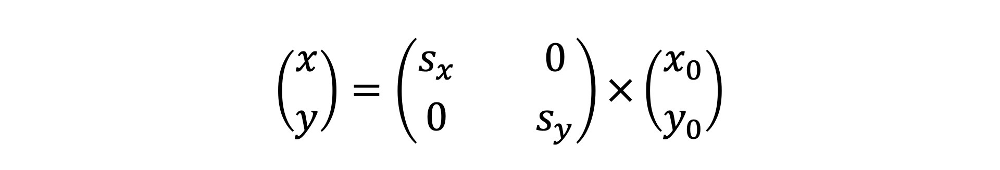

# 数学

## 三角函数

https://zh.wikipedia.org/wiki/%E4%B8%89%E8%A7%92%E5%87%BD%E6%95%B0

## 向量描述点和线

向量 v 有两个含义

- 可以表示该坐标系下位于 (x, y) 处的一个点
- 可以表示从原点 (0,0) 到坐标 (x,y) 的一根线段

```js
export class Vector2D extends Array {
  constructor(x = 1, y = 0) {
    super(x, y);
  }

  set x(v) {
    this[0] = v;
  }

  set y(v) {
    this[1] = v;
  }

  get x() {
    return this[0];
  }

  get y() {
    return this[1];
  }

  get length() {
    return Math.hypot(this.x, this.y);
  }

  get dir() {
    return Math.atan2(this.y, this.x);
  }

  copy() {
    return new Vector2D(this.x, this.y);
  }

  add(v) {
    this.x += v.x;
    this.y += v.y;
    return this;
  }

  sub(v) {
    this.x -= v.x;
    this.y -= v.y;
    return this;
  }

  scale(a) {
    this.x *= a;
    this.y *= a;
    return this;
  }

  cross(v) {
    return this.x * v.y - v.x * this.y;
  }

  dot(v) {
    return this.x * v.x + v.y * this.y;
  }

  normalize() {
    return this.scale(1 / this.length);
  }

  rotate(rad) {
    const c = Math.cos(rad);
    const s = Math.sin(rad);
    const [x, y] = this;

    this.x = x * c + y * -s;
    this.y = x * s + y * c;

    return this;
  }
}
```

## 向量的乘法


```js
// 伪代码
// a · b = a.x * b.x + a.y * b.y;
// a · b = |a||b|cos(θ)

// a、b 向量平行
a.x * b.x + a.y * b.y === a.length * b.length;

// a、b 向量垂直
a.x * b.x + a.y * b.y === 0;
```

## 仿射变换

CSS 的 transform 就是对元素应用仿射变换，仿射变换具有两个性质：

- 仿射变换前是直线段的，仿射变换后依然是直线段对两条直线段
- a 和 b 应用同样的仿射变换，变换前后线段长度比例保持不变

### 平移

```js
export class Vector2D extends Array {
  // ...
  add(v) {
    this.x += v.x;
    this.y += v.y;
    return this;
  }
}
```

### 旋转


rcos⍺、rsin⍺ 是向量 P 原始的坐标 x0、y0，所以，我们可以把坐标代入到上面的公式中，就会得到如下的公式


写成矩阵形式，得到旋转矩阵


```js
export class Vector2D extends Array {
  // ...
  rotate(rad) {
    const c = Math.cos(rad);
    const s = Math.sin(rad);
    const [x, y] = this;

    this.x = x * c + y * -s;
    this.y = x * s + y * c;

    return this;
  }
}
```

### 缩放

直接让向量与标量（标量只有大小、没有方向）相乘


也可以把它写成矩阵形式



# WebGL

## 像素点

- 一个像素点由四个通道组成，RGBA
- 一个通道是 1byte（字节） = 8bit（比特位）
- 1bit 是计算机最小存储单位，0 或 1

## 顶点着色器、片元着色器

- 顶点着色器：处理顶点的 GPU 程序代码，它可以改变顶点的信息（如顶点的坐标、法线方向、材质等等），从而改变我们绘制出来的图形的形状或者大小等等
- 片元着色器：用于处理光栅化后的像素信息，无论有多少个像素点，片元着色器都可以同时处理。从顶点着色器和图元提取像素点给片元着色器执行代码的过程，生成光栅信息的过程

顶点着色器大体上可以总结为两个作用：一是通过 gl_Position 设置顶点，二是通过定义 varying 变量，向片元着色器传递数据

```js
// 通过 gl_Position 设置顶点

// 对 position * 0.5，可将三角型周长缩小为一半，而不用更改 points 数组值
const vertex = `
  attribute vec2 position;

  void main() {
    gl_PointSize = 1.0;
    gl_Position = vec4(position * 0.5, 1.0, 1.0);
  }
`;
```

```js
// 定义 varying 变量，向片元着色器传递数据

const vsrtex = `
  attribute vec2 position;
  varying vec3 color;

  void main() {
    gl_PointSize = 1.0;
    color = vec3(0.5 + position * 0.5, 0.0);
    gl_Position = vec4(position * 0.5, 1.0, 1.0);
  }
`;

const fragment = `
  precision mediump float;
  varying vec3 color;

  void main()
  {
    gl_FragColor = vec4(color, 1.0);
  }
`;
```

## 坐标系

x 向右、y 向上、z 向屏幕外

## 绘制流程


## 创建三角型

```js
const position = new Float32Array([-1, -1, 0, 1, 1, -1]);
const bufferId = gl.createBuffer();
gl.bindBuffer(gl.ARRAY_BUFFER, bufferId);
gl.bufferData(gl.ARRAY_BUFFER, position, gl.STATIC_DRAW);

const vPosition = gl.getAttribLocation(program, 'position');
gl.vertexAttribPointer(vPosition, 2, gl.FLOAT, false, 0, 0);
gl.enableVertexAttribArray(vPosition);
```

## attribute

attribute 变量是对应于顶点的。也就是说，几何图形有几个顶点就要提供几份 attribute 数据。并且，attribute 变量只能在顶点着色器中使用，如果要在片元着色器中使用，需要我们通过 varying 变量将它传给片元着色器才行

## uniform

- uniform 变量既可以在顶点着色器中使用，也可以在片元着色器中使用
- 在 WebGL 中，我们可以通过 gl.uniformXXX(loc, u_color); 的方法将数据传给 shader 的 uniform 变量
  - `gl.uniform1f` 传入一个浮点数，对应的 uniform 变量的类型为 float
  - `gl.uniform4f` 传入四个浮点数，对应的 uniform 变量类型为 `float[4]`
  - `gl.uniform3fv` 传入一个三维向量，对应的 uniform 变量类型为 vec3
  - `gl.uniformMatrix4fv` 传入一个 4x4 的矩阵，对应的 uniform 变量类型为 mat4

# GLSL

## 基本概念

- OpenGL：全称为 Open Graphics Library（开放图形库）。是用于渲染 2D 或 3D 图像的跨语言跨平台的应用程序编程接口
- OpenGL ES：全称为 OpenGL for Embedded Systems（嵌入式系统开放图形库）。OpenGL ES 是 OpenGL 的子集，主要针对嵌入式系统（设备）设计，去除了 Open GL 中非必要的特性
- GLSL：全称为 OpenGL Shading Language（OpenGL 着色语言），是一款在 OpenGL 着色器（Shader）中使用的编程语言
- GLSL ES：全称为 OpenGL ES Shading Language（OpenGL ES 着色语言），就是用于 OpenGL ES 着色器的编程语言

## 基本语法

- 大小写敏感
- 表达式后面必须以;结束

### 变量

```cpp
int age = 18; // 声明并赋值

float money; // 声明不赋值

bool isMe; // 先声明
isMe = true; // 后赋值

const int AGE = 18; // 声明常量必须赋值
AGE = 20; // error! 常量不可以更改
```

### 函数

- 如果函数有返回值，就需要指定返回值的类型，如果没有返回值，必须指定为空 void
- 如果函数有参数，那么也需要指定参数的类型

```cpp
// 没有返回值没有参数的 main 函数
void main() {
    // ...
}
// 接收两个 int 类型参数并返回 int 类型的值的 sum 函数
int sum(int a, int b) {
    return a + b;
}

// 可以声明多次但是只允许定义一次
void foo(); // 首次声明
void foo(); // 允许重复声明
void foo() { ... } // 定义

// 重载函数允许你传入不同数量或不同类型的参数
void foo(int value) { ... }
void foo(float value) { ... }
void foo(float value1, int value2) { ... }
```

### 作用域

```cpp
// 使用一对花括号{}包裹的区域即为一个作用域
void foo() {
    int a = 0;
    {
        int b = 0;
    }
}

// 子域可以访问父域的成员
void foo(int a) {
    {
        int a = a + 1; // 第二个 a 属于父域，不冲突
        int b = a; // 访问当前作用域的 a
    }
    int c = b; // Error! 当前作用域内不存在 b
    int d = a; // 当前作用域的参数 a
}

// 同一作用域内不允许成员名称重复
int age; // 声明为整型
float age; // Error! 冲突
void age(); // Error! 冲突
```

### 运算符

- `++` `--`：自增、自减
- `+` `-` `~` `!` ：一元运算
- `*` `%` `/`：乘、取余、除
- `+` `-`： 加、减
- `<` `>` `<=` `>=` `==` `!=`：关系运算
- `&&` `^^` `||`：逻辑与、逻辑异或、逻辑同或
- `?:`：三目运算

### 限定符

#### 储存限定符

声明变量时可以在类型前面添加一个储存限定符

```cpp
// const

// 使用 const 限定符修饰的变量即为常量，常量一但定义就不可再修改
// 适用于标量、向量、矩阵、数组和结构体，但不适用于采样器

const int age = 18;
const vec4 color = vec4(0.5, 0.5, 0.5, 0.5);
// 也可以用于限定函数的参数
void doSomething(const float param) {
    param = 0.1; // Error! 不可！
    // ...
}
```

```cpp
// in

// in 限定符常用于接收从上一阶段输出的变量

in vec3 a_position; // 接收一个顶点坐标向量
in vec2 a_uv0; // 接收一个纹理坐标向量
in vec4 a_color; // 接受一个颜色向量
```

```cpp
// out

// out 限定符常用于将当前着色器中的变量输出到下一阶段

out vec2 v_uv0; // 输出一个纹理坐标向量
out vec4 v_color; // 输出一个颜色向量
```

```cpp
// uniform

// 使用 uniform 限定符来表示一个统一且只读的全局变量，该变量为所有着色器所共用
// 声明了却没有使用的 uniform 变量会在编译时被静默移除

uniform sampler2D texture;

// uniform 变量只能在程序中使用 OpenGL ES 的一系列 glUniform API 进行赋值
// 程序代码
int location = glGetUniformLocation(shaderProgram, "color"); // 查找 color 的位置（索引）
glUniform4f(location, 0.0f, 0.1f, 0.0f, 1.0f); // 给 color 赋值
// 着色器代码
uniform vec4 color; // vec4(0.0, 0.1, 0.0, 1.0)
```

#### 参数限定符

```cpp
// in
// 表示复制进函数体内的参数（值传递，不影响原来的值）
void doo(in float param) { ... } // 和普通不加限定词的参数一样

// out
// 表示函数向外复制的参数，必须是之前未被初始化的变量（引用传递，会影响原来的值）
void foo(out int param) {
    param = 666;
}
int a; // 声明了但是没有初始化
foo(a); // a = 666

// inout
// 表示参数将在函数内外保持一致（引用传递，会影响原来的值）
void goo(inout int param) {
    param = param++;
}
int b = 1;
goo(b); // b = 2
```

#### 精度限定符

浮点数、整数和采样器类型声明可以添加精度限定词来设置精度范围（精度控制可以扩展至向量和矩阵）

```cpp
// highp 满足顶点语言的最低要求（使用 highp 可以获得最大的范围和精度，但是也有可能会降低运行速度）
// mediump 范围和精度介于 highp 和 lowp 之间（通常用于储存高范围的颜色数据和低精度的几何数据）
// lowp 范围和精度比 meduimp 小，但是足以储存所有 8-bit 颜色数据

// 变量声明
lowp float a;
mediump vec2 p;
highp mat4 m;

// 函数声明（返回值和参数）也适用
highp float foo(highp param);

// 用 precision 关键字来声明指定类型的默认精度
// 声明 float 类型的默认精度为 highp
precision highp float;

// 在「未主动声明精度」的情况下
// 在顶点着色器中有以下默认精度声明
precision highp float;
precision highp int;
precision lowp sampler2D;
precision lowp samplerCube;
// 片段着色器中有以下默认精度声明
precision mediump int;
precision lowp sampler2D;
precision lowp samplerCube;
// 在片段着色器中浮点类型、浮点向量和浮点矩阵都没有默认的精度，所以使用时就必须声明其精度，或者事先声明默认精度
```

### 数据类型

#### 标量（Scalar）

标量表示只有大小没有方向的量

```cpp
// 整型
int age = 18;
// 无符号整型，在数字后面加 u
uint hello = 3u;
// 浮点型
float pi = 3.14;
// 布尔型
bool isMe = true;
```

```cpp
// 类型转换

int a = 1;

float b = float(a); // 1.0

// float 类型的值转换为 int 和 uint 时小数点后面的值将会被忽略
// 负的 float 类型的值不能转换为 uint 类型
int c = int(b); // 1

uint d = uint(c); // 1u
// 当 int、uint 或 float 类型的值转换为 bool 类型时
// 0 或 0.0 将会被转换为 false，所有非零的值都会被转换为 true
bool e = bool(d); // true

// 当 bool 类型的值转换为 int、uint 或 float 类型时
// false 将会被转换为 0 或 0.0，true 会被转换为 1 或 1.0
int f = int(e); // 1

// 将非标量值转换为标量值时，实际处理的将会是非标量值的第一个元素
vec3 a = vec3(0.1, 0.2, 0.3);
float b = float(a); // 0.1
```

#### 向量（Vector）

在 GLSL 中向量一般用于储存顶点坐标、颜色或纹理坐标数据，一个向量可以包含 2 到 4 个分量（Component）

##### 创建向量

一般情况下使用浮点（float）型 `vecn`，n 为分量的个数

```cpp
// 含有 2 个 float 类型分量的向量
vec2 coord = vec2(0.5, 0.5);
// 含有 3 个 int 类型分量的向量
ivec3 police = ivec3(1, 1, 0);
// 含有 4 个 bool 类型分量的向量
bvec4 hello = bvec4(true, false, true, false);

// 只传入一个参数的情况下会自动将其他值也设为第一个参数
vec3 three = vec3(0.1); // 等同于 vec3(0.1, 0.1, 0.1)

// 使用一个向量作为参数传给另一个向量构造函数
vec2 two = vec2(0.1, 0.2);
vec3 three = vec3(two, 0.3); // vec3(0.1, 0.2, 0.3)

// 将“大”向量作为参数来创建“小”向量（降维）会自动抛弃多余的值
vec4 four = vec4(0.1, 0.2, 0.3, 0.4);
vec3 three = vec3(four); // 等同于 vec3(0.1, 0.2, 0.3)，抛弃了 0.4
```

##### 使用分量

通过分量名来获取向量中的第 1 到第 4 个分量，所有向量都可以使用：

- xyzw（顶点坐标向量）
- rgba（颜色向量）
- stpq （纹理坐标向量）

为了代码的严谨性和可读性，使用相应的分量名

```cpp
// 顶点坐标
vec2 coord = vec2(1.0, 0.5);
float x = coord.x; // 1.0
float y = coord.y; // 0.5
float z = coord.z; // Error! 不存在

// 颜色
vec4 color = vec4(0.6, 0.8, 1,0, 0.5);
float r = color.r; // 0.6
float a = color.a; // 0.5
// 纹理坐标
vec4 texCoord = vec4(0.2, 0.4, 0.6, 0.8);
float t = texCoord.t; // 0.4
float p = texCoord.p; // 0.6
```

##### 重组分量

使用同一组分量名的任意组合来创建一个新的向量

```cpp
vec4 coord = vec4(0.1, 0.2, 0.3, 0.4);
vec2 one = coord.xx; // vec2(0.1, 0.1)
vec2 two = coord.xy; // vec2(0.1, 0.2)
vec3 three = coord.xzw; // vec3(0.1, 0.3, 0.4)
vec4 four = coord.wzyx; // vec4(0.4, 0.3, 0.2, 0.1)
vec4 boom = coord.xyzw + coord.wzyx; // vec4(0.5, 0.5, 0.5, 0.5)
vec4 hello = vec4(coord.zyx, 0.0); // vec4(0.3, 0.2, 0.1, 0.0)
```

#### 矩阵（Matrix）

矩阵最多能够支持 4 列 4 行的数据，最少 2 行 2 列，且其元素只能够为 float 类型

- `matn` 表示 n 列 n 行的浮点型矩阵，例如 `mat2`、`mat3`、`mat4`
- `matmxn` 表示 m 列 n 行的浮点型矩阵，例如 `mat2x3`、`mat4x3`

```cpp
// 创建一个 2x2 的矩阵
mat2 two = mat2(
    0.1, 0.2, // 第一列
    0.3, 0.4); // 第二列

// 创建一个 3x3 的矩阵
mat3 three = mat3(0.1, 0.2, 0.3, // 第一列
                  0.4, 0.5, 0.6, // 第二列
                  0.7, 0.8, 0.9); // 第三列

// 只传入一个参数的情况下会自动补零
mat2 two = mat2(1.0); // 等同于 mat2(1.0, 0.0, 0.0, 0.0)

// 传入向量来创建矩阵
vec2 a = vec2(1.0, 0.0);
vec2 b = vec2(0.5, 0.1);
mat2 four = mat2(a, b); // 等同于 mat2(1.0, 0.0, 0.5, 0.1)
```

```cpp
mat3 three = mat3(0.1, 0.2, 0.3, // 第一列
                  0.4, 0.5, 0.6, // 第二列
                  0.7, 0.8, 0.9); // 第三列
float el = three[0][2]; // 获取第一列第三行的元素：0.3
```

#### 采样器（Sampler）

通过采样器来获取纹理的信息

采样器只能在 Shader 外部的宿主语言中通过 OpenGL 的 API 来进行赋值

- smapler2D：用来访问 2D 纹理的句柄
- sampler3D：用来访问 3D 纹理的句柄

```cpp
// 采样器必须使用 uniform 关键字来修饰
uniform sampler2D myTexture;

// 通过内置的 texture 函数获取 myTexture 纹理 uv_0 坐标处的颜色
vec4 color = texture(myTexture, uv_0);
```

#### 结构体（Structure）

使用 struct 关键字来自定义一个新的类型，新的自定义类型可以包含其他已经定义的类型

```cpp
// 定义一个名为 circle 的类型，包含一个浮点型成员和一个四维向量成员
struct circle {
    float radius;
    vec4 color;
};
// 创建一个 circle 类型的变量
circle myCircle;
// 单独给 radius 赋值
myCircle.radius = 0.5;
```

#### 数组（Array）

在变量名称后面接上一对方括号 `[]` 就是数组

```cpp
// 字面量数组
float a[3] = float[3](0.1, 0.2, 0.3);
float b = a[1]; // 0.2

// 返回值类型
float[5] getValues() { ... }
// 参数类型
void setValues(float[2] values) { ... }
```

### 迭代

#### 循环语句

```cpp
// for

int a = 0;
for (int i = 0; i < 10; i++) {
    a++;
}
// a = 10
```

```cpp
// while

int a = 0;
while (a < 10) {
    a++;
}
// a = 10
```

```cpp
// do-while
// 先执行一次循环体，之后只要条件表达式为 true 就继续执行循环体，直到条件表达式为 false 时结束循环

int a = 0;
do {
    a++;
} while (a < 0)
// a = 1;
```

#### 选择语句

```cpp
// if

int a = 0;
if (a == 0) {
    a++;
}
// a = 1
```

```cpp
// if-else

int a = 0;
if (a == 1) {
    a++;
} else {
    a += 2;
}
// a = 2
```

```cpp
// switch
// switch 语句中的初始化表达式必须为整数，如果 case 标签的值与之相等，则执行标签后面的语句

int a = 2;
switch (a) {
    case 1:
        a += 1;
        break;
    case 2:
        a += 2;
        break;
    default:
        a += 10;
}
// a = 4
```

#### 跳转语句

```cpp
// continue
// 只可用于循环中，执行该语句时会跳过最内层循环，然后执行下一次循环

int a = 0;
for (int i = 0; i < 10; i++) {
    if (i == 6) {
        continue;
        // 当 i 为 6 时不会执行后面的语句
    }
    a++;
}
// a = 9
```

```cpp
// break
// 可用于循环和 switch 语句中，执行该语句时将立即退出最内层循环，不再继续执行循环

int a = 0;
for (int i = 0; i < 10; i++) {
    if (i == 6) {
        break;
        // 当 i 为 6 时直接跳出循环
    }
    a++;
}
// a = 6
```

```cpp
// return
// 可以用在函数（Function）里的任何位置，执行该语句会直接跳出当前函数

int plus(int a, int b) {
    return a + b;
}
int c = plus(1, 2);
// c = 3
```

```cpp
// discard
// 只能在片元着色器（Fragment Shader）中使用，执行该语句将会直接跳出片元着色器，丢弃当前片元

void main() {
    if (v_FragColor.a < 0.1) {
        discard;
        // 不透明度小于 0.1 时丢弃当前片元
        // 不执行后面的语句
    }
    gl_FragColor = v_FragColor;
}
```
