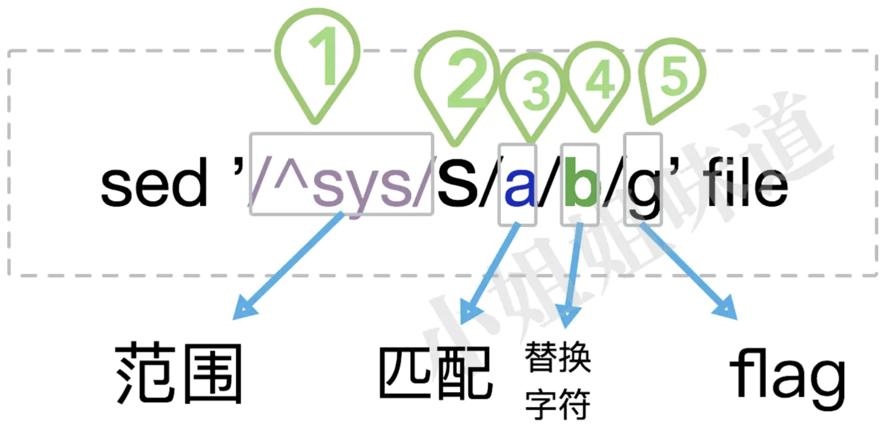

<!--linux-cheat-sheet-->

Linux & Shell 小抄

<!--more-->

# 基本

## git 安装 / 配置

yum install git-core

```bash
# 显示中文
git config --global core.quotepath false

# 用户名与邮箱
git config --global user.name "Chenng"
git config --global user.email "ringcrl@foxmail.com"
```

## oh-my-zsh

https://github.com/robbyrussell/oh-my-zsh/wiki/Installing-ZSH

https://github.com/robbyrussell/oh-my-zsh

```sh
vim .zshrc

ZSH_THEME="avit"

alias lc='ls -l node_modules/@cmao | grep ^l'
alias lk='ls -l node_modules | grep ^l'
```

## zsh-syntax-highlighting

https://github.com/zsh-users/zsh-syntax-highlighting/blob/master/INSTALL.md

```sh
# CentOS

# git clone
git clone https://github.com/zsh-users/zsh-syntax-highlighting.git ~/.oh-my-zsh/plugins/zsh-syntax-highlighting

# add to plugins in .zshrc
plugins=(
  zsh-syntax-highlighting
)

# make it work
source ~/.zshrc
```

## autosuggestions

https://github.com/zsh-users/zsh-autosuggestions/blob/master/INSTALL.md

## nvm

https://github.com/creationix/nvm#git-install

```sh
nvm install
nvm alias default
```

### 删除 node pkg 安装包

```sh
sudo rm -rf /usr/local/{bin/{node,npm},lib/node_modules/npm,lib/node,share/man/*/node.*}
```

### yarn

npm install -g yarn

# Linux

## 安装源码包

```sh
# 定制软件安装的功能/配置，生成 Makefile 文件
./configure

# 编译
make

# 安装
make install
```
## 防火墙

```sh
# 查看防火墙状态
systemctl status firewalld.service

# 关闭防火墙
systemctl stop firewalld.service

# 启动防火墙
systemctl start firewalld.service

# 禁止防火墙开机自启
systemctl disable firewalld.service

# 防火墙开机自启
systemctl enable firewalld.service
```

## 安全配置

```bash
# 更改安全项配置
vim /etc/ssh/sshd_config

# 一些安全配置项
Port 23333 # 更改默认登录端口
PermitRootLogin no # 禁止 root 账户登陆
PasswordAuthentication no # 禁止密码认证
PermitEmptyPasswords no # 禁止空密码
AllowUsers common # 只允许 common 登陆

# 修改之后重启
service sshd restart
```

## 切换语言

```sh
vim ~/.zshrc

LANG=en_US.UTF-8
```

## 配置 cc

```sh
yum -y install gcc \
automake \
autoconf \
libtool \
make \
ncurses-devel \
ncurses
```

# Mac

## 轻点确认设置

辅助功能 => 鼠标与触控板 => 触摸板选项 => 启动拖移 => 三指拖移

## 将 F1、F2 作标准键

系统偏好设置 => 键盘 => 将F1、F2等键作标准功能键

## 全键盘控制

系统偏好设置 => 键盘 => 快捷键 => 所有控制

## finder 快捷键

键盘 => 快捷键 => 服务

```sh
New Iterm2 Window Here => control + cmd + J
iCloud/自动操作 | http://t.cn/RK0jORE
Open With VSCode => control + cmd + K
```

## G502 鼠标快捷键

电脑快捷键

```
键盘 => 快捷键

调度中心 shift + cmd + F10
显示桌面 shift + cmd + F11
显示启动台 shift + cmd + F12
```

Chrome 前进后退

```
前进 cmd + ]
返回 cmd + [
```

## 允许安装不安全软件

sudo spctl --master-disable

## iTrem、rz/sz

https://www.iterm2.com

http://www.jianshu.com/p/52ff25407621

## Homebrew

http://brew.sh/index_zh-cn.html

```sh
# mysql
brew install mysql

# 设置密码
mysql_secure_installation

# 连接数据库
mysql -uroot

# 开机自启动
brew services start mysql

# 非开机自启动
mysql.server start
```

## shadowsocks

https://shadowsocks.se

https://github.com/shadowsocks/ShadowsocksX-NG/releases/

### 终端翻墙

【复制终端代理命令】，快捷命令 `ss`

```bash
echo "alias ss='export http_proxy=http://127.0.0.1:1087;export https_proxy=http://127.0.0.1:1087;'" >> ~/.zshrc
```

### 配置 PAC

```
! Put user rules line by line in this file.
! See https://adblockplus.org/en/filter-cheatsheet

mozilla.org
```

## proxychains-ng

proxychains4 安装

```sh
# 安装 proxychains4
brew install proxychains-ng

# 查看 socks5 的端口，配置 proxychains4
vim ~/.ShadowsocksX-NG/gfwlist.js
vim /usr/local/etc/proxychains.conf

# 把 socks4 去掉，在最后一行添加
socks5 127.0.0.1 1086

# 在命令之前加上 proxychains4 即可使用
proxychains4 git clone ...
```

proxychains4 配置别名 pc

```sh
vim ~/.zshrc

# proxychain-ng config
alias pc='proxychains4'
```

## 重置 Launchpad

defaults write com.apple.dock ResetLaunchPad -bool true; killall Dock

## 软件备忘

- Chrome
- Alfred
- Paste
- iStat
- Postman
- Reactotron
- Helm
- TablePlus
- FileZilla
- Magnet
- 百度网盘
- Marp（markdown 制作 PPT）
- Charles
- The Unarchiver
- IINA 播放器
- [Motrix](https://motrix.app/)
- [Snipaste](https://zh.snipaste.com/) 桌面截图工具

## 系统操作

重新安装 MacBook

https://support.apple.com/zh-cn/HT204904

出售或赠送 Mac 前该怎么做

https://support.apple.com/zh-cn/HT201065

# shell 命令

## curl 请求或下载

```sh
# 普通请求
curl https://httpbin.org/get?answer=42

# -i 显示完整 response
curl -i https://httpbin.org/get?answer=42

# -O 下载文件，-L 跟随重定向
curl -OL https://images.unsplash.com/photo-1506812574058-fc75fa93fead

# -o 重命名下载
curl -o miaxi-beach.jpg -L https://images.unsplash.com/photo-1506812574058-fc75fa93fead

# 设置 Authorization Header
curl -H "Authorization: my-secret-token" https://httpbin.org/get

# post 请求
curl -X POST -d '{"answer": 42}' https://httpbin.org/post

# 设置 Content-Type
curl -X POST -d '{"answer":42}' -H "Content-Type: application/json" https://httpbin.org/post

# -x 使用代理，-p 或 --proxytunnel 选项让 curl 穿过 HTTP 代理
curl -x 127.0.0.1:1081 -v http:/example.com/
# socks5 代理
curl -x socks5://proxy.example.com http://www.example.com/

# 读写 cookie
# -c 指示 curl 将 cookie 写入文件，-b 指示 curl 从文件读取 cookie。通常需要同时使用它们
curl -L -b cookies.txt http://example.com
curl -c cookie-jar.txt http://example.com
```

## grep

```sh
ls | grep '^doc' # 以 doc 开头
ls | grep 'js$' # 以 js 结尾
ls | grep 'REA.ME' # 匹配一个非换行符的字符
ls | grep '.*' # 匹配任意字符
ls | grep '[vd]ue' # 匹配 vue 或 due
ls | grep '[^d]ue' # 匹配除了 due 外所有的 "x"ue
ls | grep '\w' # 等价于 [A-Za-z0-9]
ls -a | grep 'l\{2\}' # 包含 ll
ls | grep '^[^x]' # 非 x 开头
ps -ef | grep '(cron|syslog)' # 包含 cron 或 syslog 的进程
```

## sed 字符串操作



```sh
# 1、5部分可以省略

# 界定符 / 可以换成任意符如 : |

# flat
g # 全文替换
p # 当使用了 -n，p 将仅输出匹配行内容
i # 忽略大小写
```

```sh
# 列出文件绝对路径，不包含隐藏文件
ls | sed "s:^:`pwd`/:"

# & 获取匹配结果，文件每一行添加引号
sed 's/.*/"&"/' file
```

## SSH 登录

### 密码登录

```sh
ssh root@192.168.80.128
```

### 密钥认证登录

```sh
## 本地本用户账号生成一个密钥对
ssh-keygen

## 查看秘钥
cat ~/.ssh/id_rsa.pub

## 服务器配置，加入公钥内容
vim ~/.ssh/authorized_keys
## 打开公钥认证配置
vim /etc/ssh/sshd_config
PubkeyAuthentication yes
## 重启 ssh
service sshd reload
```

## top 系统状态

```sh
# 进程所占的系统资源
top

# 内存使用
free -h

# 网络情况
netstat -lnp

# 正在使用的端口
netstat -tlunp
```

## lsof 查看端口占用

```
lsof -i tcp:8080
```

## usermod 用户与组

```bash
# 创建一个用户组(可以带上 -g 888 来在创建组的时候增加编号)
groupadd chenng
cat /etc/group
chenng:x:500:

# 修改组名称
groupmod -n newchenng chenng

# 修改组编号
groupmod -g 668 newchenng

# 删除用户组(必须先删除组里面的用户才能删除组)
groupdel newchenng

# 设置组密码
gpasswd chenng

# 创建一个用户
useradd -g sexy sdf
useradd -d /home/chenng chenng(没有指定用户组，会创建一个与用户名相同的用户组)
usermod -c dgdzmx sdf(增加注释)

# 修改一个用户所属用户组
usermod -g sexy chenng

# 删除用户
userdel jzmb(不会删除个人文件夹文件)
userdel -r jzmb(会删除个人文件夹文件)

# 设置用户密码
passwd chenng
```


## chmod 文件与权限

属主权限-属组权限-其他用户权限

```sh
# 更改文件属组，-R 递归更改目录所有文件属组
chgrp [-R] 属组名 文件名

# 更改所属主，可以同时更改文件属组
chown [-R] 属主名:属组名 文件名

# 更改文件9个属性，r=4、w=2、x=1
chmod [-R] 770 文件或目录
chmod +x 文件或目录
chmod -x 文件或目录
```

## systemctl 服务管理

Systemd 是 Linux 的系统工具，用来启动守护进程

### 服务列表

```sh
systemctl list-units --all --type=service

# UNIT                                   LOAD      ACTIVE   SUB     DESCRIPTION
# acpid.service                          loaded    active   running ACPI Event Daemon
# atd.service                            loaded    active   running Job spooling tools
# auditd.service                         loaded    inactive dead    Security Auditing Service
```

这些服务对应的启动脚本文件保存在 `/usr/lib/systemd/system`

### 常用命令

```sh
# 让某个服务开机自启(.service可以省略)
systemctl enable crond.service

# 不让开机自启
systemctl disable crond

# 查看服务状态
systemctl status crond

# 启动某个服务
systemctl start crond 

# 停止某个服务
systemctl stop crond

# 重启某个服务
systemctl restart crond

# 重新加载服务配置文件
systemctl reload * 

# 查询服务是否开机启动
systemctl is-enabled crond
```


## rm 删除文件

```sh
## 删除多个文件，排除部分文件
rm -rf `ls __codes__/* __tests__/*|egrep -v '(.gitkeep)'`
```

## tail 动态查看日志

```sh
# 实时追踪一个或多个文档的所有更新
tail -f /var/log/mail.log /var/log/apache/error_log
```

## du 查看文件大小

```sh
# 查看文件大小
du -sh vue.css

# 查看文件夹内容大小，-s 显示统计
du -h 工具
```

## df 查看磁盘大小

```sh
df -h
```

## tar 打包解包

```sh
# 打包
tar -zcvf dist_file source_dir

# 解包
tar -zxvf sourcefile
```

- -z 表示使用 gzip 压缩工具
- -c 压缩打包，-x 表示解压解包
- -v 表示可视化
- -f 后面跟文件名，表示压缩后的文件名为 filename，或当期需要解压文件 filename

## find 查找文件

```sh
# 找命令
which mv

# 全局寻找文件，需要先安装 mlocate 并执行 updatedb 生成索引
locate nginx.conf

# 文件查找
find root_path -name '*.md'
```

## nohup 持续运行

```sh
# 后台运行
nohup python app.py > log_app.log 2>&1 &
```

## mkdir 创建文件夹

```sh
# 递归创建目录
mkdir -p test1/test2
```

## cat & less 查看文件

```sh
# 显示行号
cat -b index.html

# 交互式查看文件
less index.html
```

## cp 复制文件

```sh
# 复制目录及目录内所有项目
cp -r source_dir dist_dir
```

## tr 管道替换

```sh
# 将所有 ; 替换为换行符方便阅读
cat vue.css | tr ';' '\n'
```

## export 环境变量

```sh
# 添加 HTTP_PROXY
HTTP_PROXY=127.0.0.1:1081
export HTTP_PROXY

# 等价于
export HTTP_PROXY=127.0.0.1:1081

# 添加环境变量 PATH
export PATH="$PATH:/home/user/bin"
```

# Shell 脚本

```sh
#!/bin/bash
```

## echo

```sh
# 查看当前使用的脚本
echo $SHELL # /bin/zsh

# -e 开启转义
echo -e "OK! \n"
echo "It is a test"

# 结果定向到文件
echo "It is a test" > myfile

# 输出脚本执行
echo `tnpm pack`
echo "$(tnpm pack)"
echo `date`

# 彩色输出
# 文字：0重置、30黑、31红、32绿、33黄、34蓝、35洋红、36青、37白
# 背景：0重置、40黑、41红、42绿、43黄、44蓝、45洋红、46青、47白
echo -e "\e[1;31m This is red text \e[0m"
echo -e "\e[1;42m Green background \e[0m"
```

## 变量

```sh
# 声明 = 两边不能有空格
# 双引号可以有变量、可以出现转义字符；单引号不可以
name="chenng"

# 最好加 {}，直接写 $name 嵌入字符串会出问题
echo $name
echo ${name} 

# 删除变量
unset name

# 获取字符串长度
string="abcd"
echo ${#string} # 4

# 提取子字符串
string="runoob is a great site"
echo ${string:1:4} # unoo
```

## 循环

```sh
# 遍历单词
for skill in Ada Coffe Action Java; do
    echo "I am good at ${skill}Script"
done

# 遍历文件
for file in `ls /etc`
do
  echo ${file}
done

# 写成一行
for file in `ls /etc`; do echo ${file}; done;
```

## 数组

```sh
array_name=("value0" "value1" "value2" "value3")
echo ${array_name[0]} # value0
echo ${array_name[@]} # "value0" "value1" "value2" "value3"
echo ${#array_name[@]} # 4
```

## sh 脚本传参

```sh
# ./test.sh 1 2 3
echo "Shell 传递参数实例！";
echo "执行的文件名：${0}"; # ./test.sh
echo "第一个参数为：${1}"; # 1
echo "第二个参数为：${2}"; # 2
echo "第三个参数为：${3}"; # 3
echo "参数个数为：${#}" # 3
```

## 运算符

### 算数运算符

```sh
a=10
b=20

# 完整的表达式要被 ` ` 包含，表达式与运算符之间要有空格
val=`expr $a + $b`
echo "a + b : $val" # a + b : 30

val=`expr $a - $b`
echo "a - b : $val" # a - b : -10

val=`expr $a \* $b`
echo "a * b : $val" # a * b : 200

val=`expr $b / $a`
echo "b / a : $val" # b / a : 2

val=`expr $b % $a`
echo "b % a : $val" # b % a : 0

if [ $a == $b ]
then
   echo "a 等于 b"
fi

if [ $a != $b ]
then
   echo "a 不等于 b"
fi
```

### 关系运算符

```sh
a=10
b=20

if [ $a -eq $b ] # 数字相等
then
   echo "$a -eq $b : a 等于 b"
else
   echo "$a -eq $b: a 不等于 b"
fi

if [ $a -ne $b ] # 数字不相等
then
   echo "$a -ne $b: a 不等于 b"
else
   echo "$a -ne $b : a 等于 b"
fi

if [ $a -gt $b ] # 数字大于
then
   echo "$a -gt $b: a 大于 b"
else
   echo "$a -gt $b: a 不大于 b"
fi

if [ $a -lt $b ] # 数字小于
then
   echo "$a -lt $b: a 小于 b"
else
   echo "$a -lt $b: a 不小于 b"
fi

if [ $a -ge $b ] # 数字大于等于
then
   echo "$a -ge $b: a 大于或等于 b"
else
   echo "$a -ge $b: a 小于 b"
fi

if [ $a -le $b ] # 数字小于等于
then
   echo "$a -le $b: a 小于或等于 b"
else
   echo "$a -le $b: a 大于 b"
fi
```

### 布尔运算符

```sh
a=10
b=20

if [ $a != $b ]
then
   echo "$a != $b : a 不等于 b"
else
   echo "$a == $b: a 等于 b"
fi

if [ $a -lt 100 -a $b -gt 15 ] # -a 与运算
then
   echo "$a 小于 100 且 $b 大于 15 : 返回 true"
else
   echo "$a 小于 100 且 $b 大于 15 : 返回 false"
fi

if [ $a -lt 100 -o $b -gt 100 ] # -o 或运算
then
   echo "$a 小于 100 或 $b 大于 100 : 返回 true"
else
   echo "$a 小于 100 或 $b 大于 100 : 返回 false"
fi

if [ $a -lt 5 -o $b -gt 100 ] # -o 或运算
then
   echo "$a 小于 5 或 $b 大于 100 : 返回 true"
else
   echo "$a 小于 5 或 $b 大于 100 : 返回 false"
fi
```

### 逻辑运算符

```sh
a=10
b=20

if [[ $a -lt 100 && $b -gt 100 ]] # 逻辑与
then
   echo "返回 true"
else
   echo "返回 false"
fi

if [[ $a -lt 100 || $b -gt 100 ]] # 逻辑或
then
   echo "返回 true"
else
   echo "返回 false"
fi
```

### 字符串运算符

```sh
a="abc"
b="efg"

if [ $a = $b ] # 字符串相等
then
   echo "$a = $b : a 等于 b"
else
   echo "$a = $b: a 不等于 b"
fi

if [ $a != $b ] # 字符串不相等
then
   echo "$a != $b : a 不等于 b"
else
   echo "$a != $b: a 等于 b"
fi

if [ -z $a ] # 字符串长度为0
then
   echo "-z $a : 字符串长度为 0"
else
   echo "-z $a : 字符串长度不为 0"
fi

if [ -n "$a" ] # 字符串长度不为0
then
   echo "-n $a : 字符串长度不为 0"
else
   echo "-n $a : 字符串长度为 0"
fi

if [ $a ] # 字符串不为空
then
   echo "$a : 字符串不为空"
else
   echo "$a : 字符串为空"
fi
```

## 函数

```sh
# 不带 return 语句
demoFun(){
    echo "这是我的第一个 shell 函数!"
}
echo "-----函数开始执行-----"
demoFun
echo "-----函数执行完毕-----"
```

```sh
# 带有 return 语句
funWithReturn(){
    echo "这个函数会对输入的两个数字进行相加运算..."
    echo "输入第一个数字: "
    read aNum
    echo "输入第二个数字: "
    read anotherNum
    echo "两个数字分别为 $aNum 和 $anotherNum"
    return `expr $aNum + $anotherNum`
}
funWithReturn
echo "输入的两个数字之和为 $?"
```

```sh
# 带参数调用
funWithParam(){
    echo "第一个参数为 $1 !"
    echo "第二个参数为 $2 !"
    echo "第十个参数为 $10 !" # 大于10之后需要通过 ${n} 来取
    echo "第十个参数为 ${10} !"
    echo "第十一个参数为 ${11} !"
    echo "参数总数有 $# 个!"
    echo "作为一个字符串输出所有参数 $* !"
}
funWithParam 1 2 3 4 5 6 7 8 9 34 73
```

## 流程控制

```sh
# 文件属性测试
# 一个文件是否存在 [ -e $var ]
# 是否是目录 [ -d $var ]
if [ -d dist ]
then
   rm -rf dist
fi
```

```sh
# 写成一行
if [ $(ps -ef | grep -c "ssh") -gt 1 ]; then echo "true"; fi

a=10
b=20
if [ $a == $b ]
then
   echo "a 等于 b"
elif [ $a -gt $b ]
then
   echo "a 大于 b"
elif [ $a -lt $b ]
then
   echo "a 小于 b" # 输出
else
   echo "没有符合的条件"
fi
```

## 输出重定向

```sh
# 将输出重定向到 file
command > file

# 将输出以追加的方式重定向到 file
command >> file

# 文件描述符 0 通常是标准输入（STDIN）
# 文件描述符 1 是标准输出（STDOUT）
# 文件描述符 2 是标准错误输出（STDERR）

# 输出错误到文件
command 2 >> file

# 将标准输出和标准错误合并输出到文件 2>&1
command >> file 2>&1
```

## 综合应用

### sed 修改文件

```sh
CURRENT_DIR=$(cd $(dirname $0); pwd)
cd ${CURRENT_DIR}
cd ../

sed -i "" 's/"private": true/"private": false/' package.json
```

### git lint

```sh
branch="$(git rev-parse --abbrev-ref HEAD)"

if [ "$branch" = "master" ]; then
    echo "不允许直接提交代码到 master。" 
    exit 1
fi

npm run tsccheck

if [ "$?" == 0 ]; then
    echo "tsc check 通过。"
else
    exit 1
fi

npm run lint

if [ "$?" == 0 ]; then
    echo "lint 通过。"
else
    exit 1
fi
```

# 命令行工具

## autojump

```sh
# https://github.com/wting/autojump

# Mac
brew install autojump
# vim ~/.zshrc
[ -f /usr/local/etc/profile.d/autojump.sh ] && . /usr/local/etc/profile.d/autojump.sh

# CentOS
yum install autojump
# vim ~/.zshrc
plugins=(
  autojump
)
```

## tldr

```sh
npm install -g tldr
```

## pm2

```sh
npm install -g pm2
```

## locate

```sh
# Linux
yum -y install mlocate
updatedb

# Mac

alias updatedb='/usr/libexec/locate.updatedb'
```

## nodemon

```sh
npm install -g nodemon
```

## tree

```sh
# Linux
yum -y install tree

# Mac
brew install tree
```

## lazygit

https://github.com/jesseduffield/lazygit

```sh
# CentOS
# 下载 lazygit_0.5_Linux_x86_64.tar.gz
alias lg="$HOME/script/lazygit"
```

## torrent

https://github.com/maxogden/torrent

## httpie

https://httpie.org/doc

## fx json 解析器

https://github.com/antonmedv/fx

# Vim

## 配置

```bash
cp /usr/share/vim/vimrc ~/.vimrc

vim ~/.vimrc

# vim 中文乱码
set encoding=utf-8

# 语法高亮
syntax enable
syntax on

# 显示行号
set nu!
```

## 插件

```sh
# vim-pathogen
https://github.com/tpope/vim-pathogen

# vim-javascript
https://github.com/pangloss/vim-javascript

# typescript-vim
https://github.com/leafgarland/typescript-vim/wiki/Installation
```

## 快捷键

```sh
# 上下左右
hjkl

# 前翻半页 || 后翻半页
ctrl + u || ctrl + d

# 前翻一页 || 后翻一页
ctrl + f || ctrl + b

# 到首行
gg

# 到尾行
G

# 到 n 行
nG

# 到行首 || 到行位
^ || $

# 复制光标所在行
yy

# 剪切光标所在行
dd

# 粘贴
p

# 高亮选择，按 y 复制，按 d 剪切
v

# 撤销 || 重做
u || ctrl + r

# 当前光标插入 || 下一行插入 || 上一行插入
i || o || O

# 查找字符，n 查看下一个结果，N 查看上一个结果
/word

# 保存及退出
:w # 保存文本
:q # 退出vim。
:w! #强制保存，在 root 用户下，即使文本只读也可以完成保存。
:q! # 强制退出，所有改动不生效
:wq # 保存并退出

# 删除一个字符
x

# 到下一个单词头
w

# 到上一个单词头
b

# 删除一个单词
dw

# 显示当前文件信息
ctrl + g
```