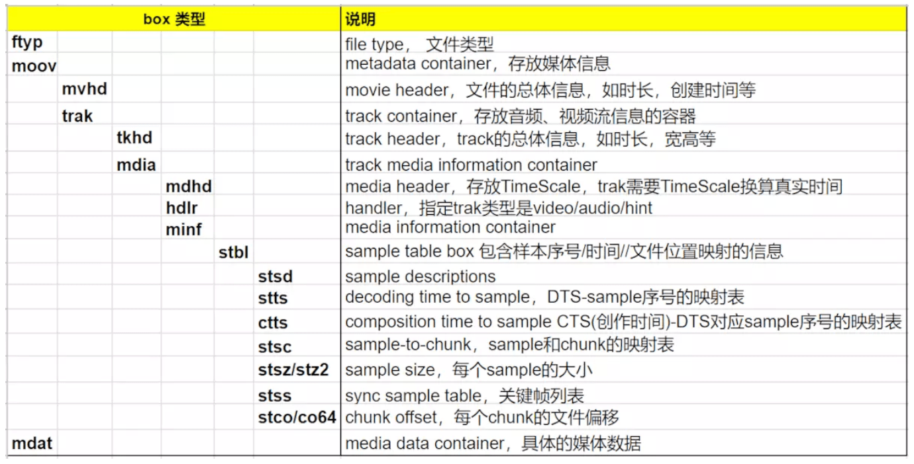

# 参考

- 《FFMpeg 从入门到精通》
- [mp4文件格式解析](https://www.jianshu.com/p/529c3729f357)

# ffprobe

```sh
ffprobe -show_format -show_streams -print_format json -loglevel fatal ./第一段.mp4
```

# ffmpeg

## 参数

### 参数位置

```sh
ffmpeg \
{1} \ # 1. 全局参数
{2} \ # 2. 输入文件参数
-i \
{3} \ # 3. 输入文件 
{4} \ # 4. 输出文件参数
{5} # 5. 输出文件


ffmpeg \
-y \ # 全局参数
-c:a libfdk_aac -c:v libx264 \ # 输入文件参数
-i input.mp4 \ # 输入文件
-c:v libvpx-vp9 -c:a libvorbis \ # 输出文件参数
output.webm # 输出文件
```

### 常用参数

```sh
-c # 指定编码器
-c copy # 直接复制，不经过重新编码（这样比较快）
-c:v # 指定视频编码器
-c:a # 指定音频编码器
-i # 指定输入文件
-an # 去除音频流
-vn # 去除视频流
-preset # 指定输出的视频质量，会影响文件的生成速度，有以下几个可用的值 ultrafast, superfast, veryfast, faster, fast, medium, slow, slower, veryslow
-y # 不经过确认，输出时直接覆盖同名文件
```

### 详细参数

```
-f fmt 指定格式(音频或视频格式)
-i filename	指定输入文件名，在 linux 下当然也能指定:0.0(屏幕录制)或摄像头
-y 覆盖已有文件
-t duration	记录时长为
-fs limit_size 设置文件大小上限
-ss time_off 从指定的时间(s)开始，[-]hh:mm:ss[.xxx]的格式也支持
-re 代表按照帧率发送,作为推流工具一定要加入参数,否则 ffmpeg 会按照最高速率向流媒体服务器不停发送数据

-b 指定比特率(bits/s)，似乎 ffmpeg 是自动 VBR 的，指定了就大概是平均比特率
-bitexact 使用标准比特率
-vb 指定视频比特率(bits/s)
-vframes number 设置转换多少桢(frame)的视频
-r rate 帧速率(fps)（可以改，确认非标准桢率会导致音画不同步，所以只能设定为15或者29.97）
-s size 指定分辨率 (320x240)
-aspect aspect 设置视频长宽比(4:3, 16:9 or 1.3333, 1.7777)
-croptop size 设置顶部切除尺寸(in pixels)
-cropbottom size 设置底部切除尺寸(in pixels)
-cropleft size 设置左切除尺寸 (in pixels)
-cropright size 设置右切除尺寸 (in pixels)
-padtop size 设置顶部补齐尺寸(in pixels)
-padbottom size 底补齐(in pixels)
-padleft size 左补齐(in pixels)
-padright size 右补齐(in pixels)
-padcolor color 补齐带颜色(000000-FFFFFF)
-vn 取消视频
-vcodec codec 强制使用codec编解码方式('copy' to copy stream)
-sameq 使用同样视频质量作为源（VBR）
-pass n 选择处理遍数（1或者2）。两遍编码非常有用。第一遍生成统计信息，第二遍生成精确的请求的码率
-passlogfile file 选择两遍的纪录文件名为 file
```

## 常见用法

### 转换编码格式

```sh
# 转成 H.264 编码，一般使用编码器libx264
ffmpeg -i [input.file] -c:v libx264 output.mp4

# 转成 H.265 编码
ffmpeg -i [input.file] -c:v libx265 output.mp4
```

### 转换容器格式

```sh
# 内部的编码格式不变，所以使用 -c copy 指定直接拷贝，不经过转码，这样比较快
ffmpeg -i input.mp4 -c copy output.webm
```

### 调整码率

- 调整码率（transrating）指的是，改变编码的比特率，一般用来将视频文件的体积变小
- 下面的例子指定码率最小为 964K，最大为 3856K，缓冲区大小为 2000K

```sh
ffmpeg \
-i input.mp4 \
-minrate 964K -maxrate 3856K -bufsize 2000K \
output.mp4
```

### 改变分辨率

```sh
# 转为 480p
ffmpeg \
-i input.mp4 \
-vf scale=480:-1 \
output.mp4
```

### 提取音频

```sh
ffmpeg \
-i input.mp4 \
-vn -c:a copy \
output.aac
```

### 添加音轨

```sh
ffmpeg \
-i input.aac -i input.mp4 \
output.mp4
```

### 视频剪裁

指定开始时间（start）和持续时间（duration），也可以指定结束时间（end）

```sh
ffmpeg -ss <start> -i <input> -t <duration> -c copy <output>
ffmpeg -ss <start> -i <input> -to <end> -c copy <output>
```

```sh
# 将文件从 50 秒开始剪切 20 秒,输入到新文件,-ss 是指定开始时间,-t 是指定时长
ffmpeg -i input.mp4 -ss 00:00:50.0 -codec copy -t 20 output.mp4
```

### mp4 导出 gif

```sh
# -ss 00:00:03 表示从第 00 分钟 03 秒开始制作 GIF
# -t 3 表示把持续 3 秒的视频转换为 GIF
# -s 640x360 是 GIF 的分辨率
# -r 15 表示帧率，网上下载的视频帧率通常为 24，设为 15 效果挺好了
ffmpeg -i /input/01.mp4 -ss 00:00:02 -t 3 -s 360x640 -r 15 /output/foo.gif
```

### 截图

```sh
# 截取单图
ffmpeg -ss 00:00:05 -i /input/01.mp4 -vframes 1 -q:v 2 /output/01.jpg

# 按帧截图
ffmpeg -i /input/01.mp4 -r 0.25 /output/prefix_%03d.jpg

# 每隔 1s 截一张图
ffmpeg -i /input/01.mp4 -y -f image2 -vf fps=fps=1 /output/prefix_%03d.jpeg
```

### ss 与 t 进行切片

- ss 指定剪裁的开头部分
- t 指定视频总时长
- output_ts_offset 指定输出 start_time

```sh
# ss 从 8s 开始截取后面的内容
ffmpeg -ss 8 -i input.mp4 -c copy output.ts

# t 截取视频前10秒
ffmpeg -i input.mp4 -c copy -t 10 -copyts output.ts

# 指定输出文件的 start_time
ffmpeg -i input.mp4 -c copy -t 10 -output_ts_offset 120 output.mp4
```

### 音视频文件音频流提取

```sh
ffmpeg -i input.mp4 -vn -acodec copy output.aac
```

### 音视频文件中视频流提取

```sh
ffmpeg -i input.mp4 -vcodec copy -an output.h264
```

# FFMpeg 转封装

## MP4

### 基本概念

- MP4 文件由许多个 Box 与 FullBox 组成
- 每个 Box 由 Header 和 Data 两部分组成
- FullBox 是 Box 的扩展，其在 Box 结构的基础上，在 Header 中增加 8 位 version 标志和 24 位的 flags 标志
- Header 包含了整个 Box 的长度的大小（size）和类型（type），当 size 等于 0 时，代表这个 Box 是文件的最后一个 Box。当 size 等于 1 时，说明 Box 长度需要更多的位来描述，在后面会定义一个 64 位的 largesize 用来描述 Box 的长度。当 Type 为 uuid 时，说明这个 Box 中的数据是用户自定义扩展类型
- Data 为 Box 的实际数据，可以是纯数据，也可以是更多的子 Box
- 当一个 Box 中的 Data 是一系列的子 Box 时，这个 Box 又可以成为 Container Box

### 基本信息

audio信息：

- smplrate：sample rate(采样率)
- channel：通道个数
- bitrate：比特率
- audiosamplenum：音频sample的个数

video信息：

- width、height：视频的宽/高
- bitrate：比特率(码率)，秒为单位。等于视频总的大小/时长
- frames：视频帧数
- fps：帧率(frame per second)
- total_time：时间长度，ms为单位。等于duration/timescale
- timescale：时间的粒度，1000表示1000个单位为1s
- duration：时间粒度的个数。
- videosamplenum：视频sample的个数

### MP4 文件的 Box 列表



MacOS 使用 https://github.com/ksvc/MediaParser 进行解析查看

根节点主要包含三个节点：ftyp、moov、mdat

- ftyp：文件类型，描述遵从的规范的版本
- moov box：媒体的 metadata 信息
- mdat：具体的媒体数据

moov 和 mdat 存放前后没有强制要求，如果希望 MP4 文件被快速打开，需要 moov 存放在 mdat 前面，如果存放在后面需要将 MP4 文件下载完成后才能进行播放，使用 faststart 指令提前

### Box 组成


- box 由 header 和 body 组成，其中 header 指明 box 的 size 和 type。size 是包含 box header 的整个 box 的大小
- box type，通常是4个ASCII码的字符如“ftyp”、“moov”等，这些 box type 都是已经预定义好的，表示固定的含义。如果是“uuid”，表示该 box 为用户自定义扩展类型，如果 box type 是未定义的，应该将其忽略
- 如果 header 中的 size 为 1，则表示 box 长度需要更多的 bits 位来描述，在后面会有一个 64bits 位的 largesize 用来描述 box 的长度。如果 size 为 0，表示该 box 为文件的最后一个 box，文件结尾（同样只存在于“mdat”类型的box中）
- box 中可以包含 box，这种 box 称为 container box
- box 分为两种，Box 和 Fullbox。FullBox 是 Box 的扩展，Header 中增加了version 和 flags 字段

## FLV

Adobe 发布既可用作直播也可以用作点播的封装格式，封装格式均以 FLVTAG 的形式存在，每一个 TAG 独立存在

FLVTAG 氛围 TAGHeader 和 TAGBody 两部分

封装 FLV 时如果内部的音频或者视频不符合标准时就会出错，例如 AC3 音频封装：

```sh
ffmpeg -i input_ac3.mp4 -c copy -f flv output.flv
```

解决方法就是音频从 AC3 转为 AAC 或者 MP3 这种 FLV 支持的音频即可

```sh
ffmpeg -i input_ac3.mp4 -vcodec copy -acodec acc -f flv output.flv
```

## M3U8

M3U8 是常见的流媒体格式：

- HLS：http live streaming，是一个基于 http 的互联网流媒体传输协议，m3u8 是该协议下具体的文件封装实现
- m3u8：文件目录
- ts：文件片

```
#EXTM3U // 必须包含的标签
#EXT-X-VERSION:3 // 常见是3，一直在发展
#EXT-X-TARGETDURATION:4 // 每个 ts 有自己的 duration，这个是最大那个分片的浮点数四舍五入之后的整数值
#EXT-X-MEDIA-SEQUENCE:0 // 直播时的直播切片，以这个标签值为参考播放对应序列号的切片
#EXTINF:3.760000, // 每一个分片的 duration，除了 duration 还可以有其他信息，用 , 隔开
out0.ts // 可以是相对路径、绝对路径、互联网路径
#EXTINF:1.880000,
out1.ts
#EXTINF:2.760000,
out2.ts
#EXTINF:1.880000,
out3.ts
#EXTINF:1.040000,
out4.ts
#EXT-X-ENDLIST // 表明后面没有更多切片了，作为点播存在的时候使用
```

mp4 转 hls

```sh
ffmpeg -re -i 00.mp4 -c copy -f hls -bsf:v h264_mp4toannexb output.m3u8
```

生成的文件：

- output.m3u8
- output1.ts
- output2.ts
- output3.ts

### Nginx 支持推流

```
location / {
    client_max_body_size 10M;
    dav_access group:rw all:rw;
    dav_methods PUT DELETE MKCOL COPY MOVE;
    root html/;
}
```

```sh
ffmpeg -i input.mp4 -c copy -f hls -hls_time 3 -hls_list_size 0 -method PUT -t 30 http://127.0.0.1/test/output_test.m3u8
```

## DASH

动态自适应流

```sh
ffmpeg -h muxer=dash
```

# FFMpeg 转码

## 软编解码

- 预设编码参数 preset：ultrafase 最快，placebo 最慢，编码速度影响清晰度
- 编码优化参数 tune：用 zerolatency 提升直播效率
- 配置档次 profile：baseline profile 不包含 B 帧，main profile 和 high profile 包含 B 帧，同等码率（可以简单的认为等于文件大小除以播放时间）时，B 帧越多清晰度越高

## 硬编解码

基于 CPU 的软编码成本较高性价比低，常用 Nvidia GPU、Intel QSV 进行硬编码

```sh
# 查看 MacOS 硬编码参数
ffmpeg -h encoder=h264_videotoolbox

# 设置码率 2Mbit/s
ffmpeg -vcodec h264 -i 00.mp4 -vcodec h264_videotoolbox -b:v 2000k output.mp4
```

# FFMpeg 滤镜

【输入流或标记名】滤镜参数【临时标记名】；【输入流或标记名】滤镜参数【临时标记名】；···

```sh
# 视频左上角加图片 logo 水印
ffmpeg -i input.mp4 -i logo.png -filter_complex "[1:v]scale=144:144[logo];[0:v][logo]overlay=x=0:y=0" output.mp4
```

## 文字水印 drawtext

```sh
ffmpeg -i input.mp4 -vf "drawtext=fontsize=100:fontfile=FreeSerif.ttf:text='hello world':x=20:y=20" output.mp4
```

## 图片水印 movie

```sh
ffmpeg -i input.mp4 -vf "movie=logo.png[wm];[in][wm]overlay=30:10[out]" output.mp4
```

## 音频探测

```sh
ffmpeg -i 00.mp4 -filter_complex "showwavespic=s=640x120" -frames:v 1 output.png
```

## 视频字幕

```sh
ffmpeg -i input.mp4 -vf ass=t1.ass -f mp4 output.mp4
```

## vframe 截取单图

```sh
# 1.135s 位置截取一张图
ffmpeg -i input.mp4 -ss 00:00:1.135 -vframes 1 output.png
```

## fps 定时截图

```sh
# 每隔1s截取一张图
ffmpeg -i input.mp4 -vf fps=1 out%d.png
```

## atempo 音频倍速处理

```sh
ffmpeg -i input.mp4 -filter_complex "atempo=tempo=2.0" -acodec aac output.acc
```

## setpts 视频倍速处理

```sh
ffmpeg -re -i input.mp4 -filter_complex "setpts=PTS*2" output.mp4
```